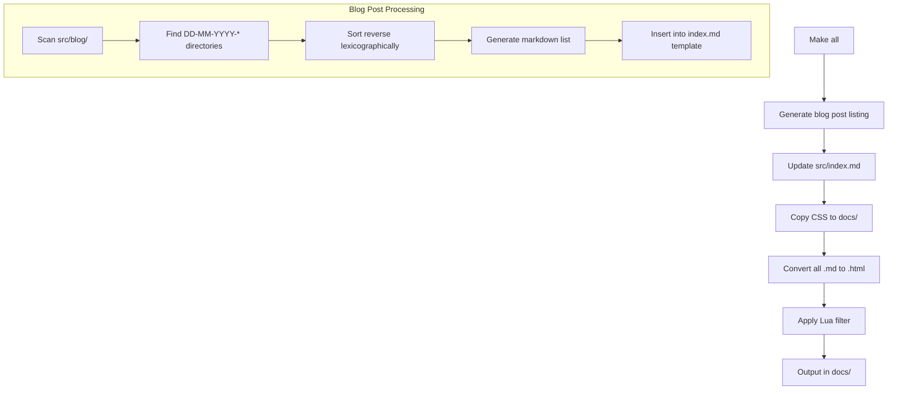

# Blog System Architecture Design

## Overview
This document outlines the design for integrating a blog system into the existing static site generator project (`bakineugene.github.io`). The system will allow creating blog posts in a structured format while maintaining compatibility with the current Pandoc-based build system.

## Current System Analysis

### Existing Architecture
- **Static Site Generator**: Pandoc with custom Lua filter
- **Build System**: GNU Make
- **Source Structure**: Markdown files in `src/` directory
- **Output Structure**: HTML files in `docs/` directory
- **Link Handling**: Lua filter converts `.md` links to `.html` links

### Key Constraints
1. No server-side processing (static site)
2. Minimal dependencies (Pandoc, Make)
3. GitHub Pages deployment from `docs/` directory
4. Existing content structure (`attiny13a/` articles)

## Blog System Requirements

1. **Post Organization**: Blog posts in folders named `DD-MM-YYYY-Post_Title`
2. **Post Content**: Each folder contains `index.md` and optional image files
3. **Index Listing**: All posts appear on main index page in reverse lexicographical order
4. **Compatibility**: Must work with existing Lua filter and Makefile

## Proposed Architecture

### Directory Structure
```
src/
├── index.md                    # Main weblog index (with generated post list)
├── attiny13a/                  # Existing technical articles
└── blog/                       # New blog posts directory
    ├── 13-05-2026-My_New_Post/
    │   ├── index.md            # Post content
    │   └── images/             # Optional images
    └── 10-04-2026-Another_Post/
        ├── index.md
        └── featured.jpg
```

### Build Process Modifications



### Key Components

#### 1. Blog Post Generator Script (`scripts/generate-blog-index.py`)
- **Purpose**: Generate markdown list of blog posts
- **Input**: `src/blog/` directory
- **Output**: Markdown list with post links
- **Logic**:
  1. Scan `src/blog/` for directories matching pattern `\d{2}-\d{2}-\d{4}-.*`
  2. Sort directories in reverse lexicographical order
  3. For each directory:
     - Extract date and title from directory name
     - Format date as "DD Month YYYY" (e.g., "13 May 2026")
     - Create link: `[Title](blog/DD-MM-YYYY-Title/index.html)`
  4. Generate markdown list with dates and titles

#### 2. Modified Makefile
- **New Targets**:
  - `generate-blog-index`: Run the generator script
  - `blog-posts`: Dependency for index.md generation
- **Modified Targets**:
  - `all`: Depend on blog index generation
  - `src/index.md`: Regenerate with post listings
- **New Variables**:
  - `BLOG_DIRS`: List of blog post directories
  - `BLOG_HTML`: Corresponding HTML output files

#### 3. Index Template (`src/index.template.md`)
- **Structure**:
  ```
  # Weblog index
  
  <!-- BLOG_POSTS_START -->
  <!-- Generated content will be inserted here -->
  <!-- BLOG_POSTS_END -->
  ```
- **Processing**: Generator script replaces content between markers

#### 4. Blog Post Metadata
- **Optional Frontmatter**: Posts can include YAML frontmatter for extended metadata
- **Image Support**: Images referenced with relative paths work automatically
- **Cross-linking**: Posts can link to each other using `.md` extension (converted by Lua filter)

## Implementation Plan

### Phase 1: Foundation
1. Create directory structure:
   - `src/blog/` (for blog posts)
   - `scripts/` (for generator script)
   - `plans/` (for documentation)
2. Create blog post generator script in Python
3. Create index template with placeholder

### Phase 2: Build System Integration
1. Modify Makefile to:
   - Include blog directories in `SRC_MD` variable
   - Add `generate-blog-index` target
   - Update `all` target dependencies
2. Test build process with empty blog directory

### Phase 3: Template Processing
1. Implement template processing in generator script
2. Create sample blog posts for testing
3. Verify generated index.html contains correct post listings

### Phase 4: Polish and Documentation
1. Add error handling to generator script
2. Update AGENT.md with blog system instructions
3. Create example blog post template
4. Test complete workflow

## Detailed Technical Specifications

### Blog Post Generator Script

```python
#!/usr/bin/env python3
"""
Generate blog post listing for index.md
Scans src/blog/ for directories matching DD-MM-YYYY-* pattern
Generates markdown list in reverse lexicographical order
"""

import os
import re
import sys
from datetime import datetime

def extract_date_title(dirname):
    """Extract date and title from directory name"""
    pattern = r'^(\d{2})-(\d{2})-(\d{4})-(.+)$'
    match = re.match(pattern, dirname)
    if match:
        day, month, year, title = match.groups()
        # Convert to readable date
        date_obj = datetime(int(year), int(month), int(day))
        readable_date = date_obj.strftime('%d %B %Y')
        # Convert underscores to spaces in title
        readable_title = title.replace('_', ' ')
        return {
            'dirname': dirname,
            'date': readable_date,
            'title': readable_title,
            'raw_date': f'{year}{month}{day}'  # For sorting
        }
    return None

def generate_blog_listing(blog_dir='src/blog'):
    """Generate markdown list of blog posts"""
    if not os.path.exists(blog_dir):
        return "# Blog\n\nNo blog posts yet.\n"
    
    posts = []
    for item in os.listdir(blog_dir):
        item_path = os.path.join(blog_dir, item)
        if os.path.isdir(item_path):
            post_info = extract_date_title(item)
            if post_info:
                posts.append(post_info)
    
    # Sort in reverse lexicographical order (newest first)
    posts.sort(key=lambda x: x['dirname'], reverse=True)
    
    # Generate markdown
    lines = ["# Blog Posts\n"]
    for post in posts:
        link = f"blog/{post['dirname']}/index.html"
        lines.append(f"- **{post['date']}**: [{post['title']}]({link})")
    
    return '\n'.join(lines)

if __name__ == '__main__':
    listing = generate_blog_listing()
    print(listing)
```

### Modified Makefile

```makefile
# Find markdown files (including blog posts)
SRC_MD := $(shell find src -type f -name "*.md")

# Map to docs
OUT_HTML := $(patsubst src/%.md,docs/%.html,$(SRC_MD))

CSS_SRC := style.css
CSS_DST := docs/style.css

CSS := /style.css

# Blog-related variables
BLOG_DIR := src/blog
BLOG_INDEX_TEMPLATE := src/index.template.md
BLOG_INDEX_OUTPUT := src/index.md
GENERATOR_SCRIPT := scripts/generate-blog-index.py

# Default target
all: $(CSS_DST) $(OUT_HTML)

# Generate blog index before building
$(BLOG_INDEX_OUTPUT): $(BLOG_INDEX_TEMPLATE) $(GENERATOR_SCRIPT)
	@mkdir -p scripts
	@mkdir -p $(BLOG_DIR)
	python3 $(GENERATOR_SCRIPT) > $(BLOG_INDEX_OUTPUT).tmp
	@if [ -f $(BLOG_INDEX_TEMPLATE) ]; then \
		sed '/<!-- BLOG_POSTS_START -->/,/<!-- BLOG_POSTS_END -->/c\<!-- BLOG_POSTS_START -->\n'"$$(cat $(BLOG_INDEX_OUTPUT).tmp)"'\n<!-- BLOG_POSTS_END -->' $(BLOG_INDEX_TEMPLATE) > $(BLOG_INDEX_OUTPUT); \
	else \
		cp $(BLOG_INDEX_OUTPUT).tmp $(BLOG_INDEX_OUTPUT); \
	fi
	@rm -f $(BLOG_INDEX_OUTPUT).tmp

# Copy CSS once
$(CSS_DST): $(CSS_SRC)
	@mkdir -p docs
	cp $(CSS_SRC) $(CSS_DST)

# Convert markdown to HTML (depends on generated index)
docs/%.html: src/%.md | $(CSS_DST) $(BLOG_INDEX_OUTPUT)
	@mkdir -p $(dir $@)
	pandoc $< -o $@ -s --css=$(CSS) --lua-filter=md-to-html-links.lua

# Clean
clean:
	rm -rf docs
	rm -f $(BLOG_INDEX_OUTPUT)

.PHONY: all clean
```

### Index Template

```markdown
# Weblog index

Welcome to my weblog. Here you'll find technical articles, project updates, and miscellaneous thoughts.

<!-- BLOG_POSTS_START -->
<!-- Generated content will be inserted here -->
<!-- BLOG_POSTS_END -->

## Other Content

- [ATtiny13A Articles](attiny13a/index.html)
- [Resume](resume/index.html)
```

## Compatibility Considerations

### Lua Filter Compatibility
- The existing `md-to-html-links.lua` filter will automatically convert `.md` links in blog posts to `.html`
- Blog posts can link to each other using relative paths with `.md` extension
- External links remain unchanged

### Existing Content
- `attiny13a/` articles remain unchanged
- Resume submodule continues to work independently
- All existing URLs remain valid

### GitHub Pages Deployment
- Generated HTML in `docs/` directory works with current deployment
- No changes to deployment process needed
- Blog post URLs will be: `https://bakineugene.github.io/blog/DD-MM-YYYY-Title/`

## Testing Strategy

### Unit Tests
1. **Generator Script**: Test directory parsing, sorting, and markdown generation
2. **Makefile**: Test build dependencies and regeneration
3. **Template Processing**: Test placeholder replacement

### Integration Tests
1. **Full Build**: Run `make clean && make` with sample blog posts
2. **Link Verification**: Check that all generated links work correctly
3. **Order Verification**: Confirm reverse lexicographical sorting

### Sample Test Cases
1. Empty blog directory → "No blog posts yet" message
2. Single blog post → Correct listing
3. Multiple posts → Correct reverse chronological order
4. Posts with images → Images copied correctly
5. Cross-linked posts → Links converted correctly

## Maintenance and Extensibility

### Adding New Blog Posts
1. Create directory: `src/blog/DD-MM-YYYY-Post_Title/`
2. Add `index.md` with content
3. Add optional images in same directory
4. Run `make` to rebuild site

### Future Enhancements
1. **RSS Feed**: Generate XML feed from blog posts
2. **Post Categories**: Add tagging/categorization system
3. **Search**: Client-side search with lunr.js
4. **Comments**: Static comments via GitHub issues
5. **Pagination**: Split index into multiple pages for large blogs

## Conclusion

This design maintains the simplicity and minimalism of the existing static site generator while adding a structured blog system. The solution leverages the existing build system with minimal new dependencies, ensuring easy maintenance and compatibility with the current workflow.

The key innovation is the pre-processing step that generates dynamic content (blog post listings) during the build process, allowing for a fully static output that can be served by GitHub Pages.