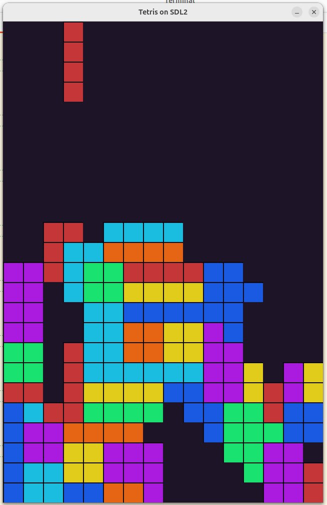

*23:22*  
[https://github.com/bakineugene/tetris_c/commit/32aaedda94ab2c851b88a176707eae4a5cd794a5](https://github.com/bakineugene/tetris_c/commit/32aaedda94ab2c851b88a176707eae4a5cd794a5)
[https://github.com/bakineugene/tetris_c/commit/49cac47be6dba49a0a13e76958bf09f49f627536](https://github.com/bakineugene/tetris_c/commit/49cac47be6dba49a0a13e76958bf09f49f627536)

Добавил управление элементами (кроме вращения) и исчезновение заполненных слоев

Кроме того решил, что у меня будет 2*3 матрицы - то есть экран 16 * 24

Код, правда, уже нечитаемый, грядет чистка

#tetris_c

---

*14:24*  
Кстати, фигуры в тетрисе называются тетрамино ([https://ru.wikipedia.org/wiki/Тетрамино](https://ru.wikipedia.org/wiki/Тетрамино))
Вот здесь есть summary по различным правилам вращения - [https://strategywiki.org/wiki/Tetris/Rotation_systems](https://strategywiki.org/wiki/Tetris/Rotation_systems)

---

*23:07*  
[https://github.com/bakineugene/tetris_c/commit/c684568582064311f1e900fc1ac5bf37d2d11750](https://github.com/bakineugene/tetris_c/commit/c684568582064311f1e900fc1ac5bf37d2d11750)
Хоть это и только для отладки, не удержался и добавил цвета

#tetris_c

---

*12:09*  
В курсе по архитектуре на skillbox ответы проверяет теперь Skillbox AI вместо человека.

Это, конечно, подстава, но зато до меня внезапно доперло, что ИИ теперь может проверять мои ответы на вопросы во всяких учебниках, где ответов нет в конце.
[Video: videos/Кин_дза_дза_Женщину_вынули_автомат_засунули.mp4](videos/Кин_дза_дза_Женщину_вынули_автомат_засунули.mp4)