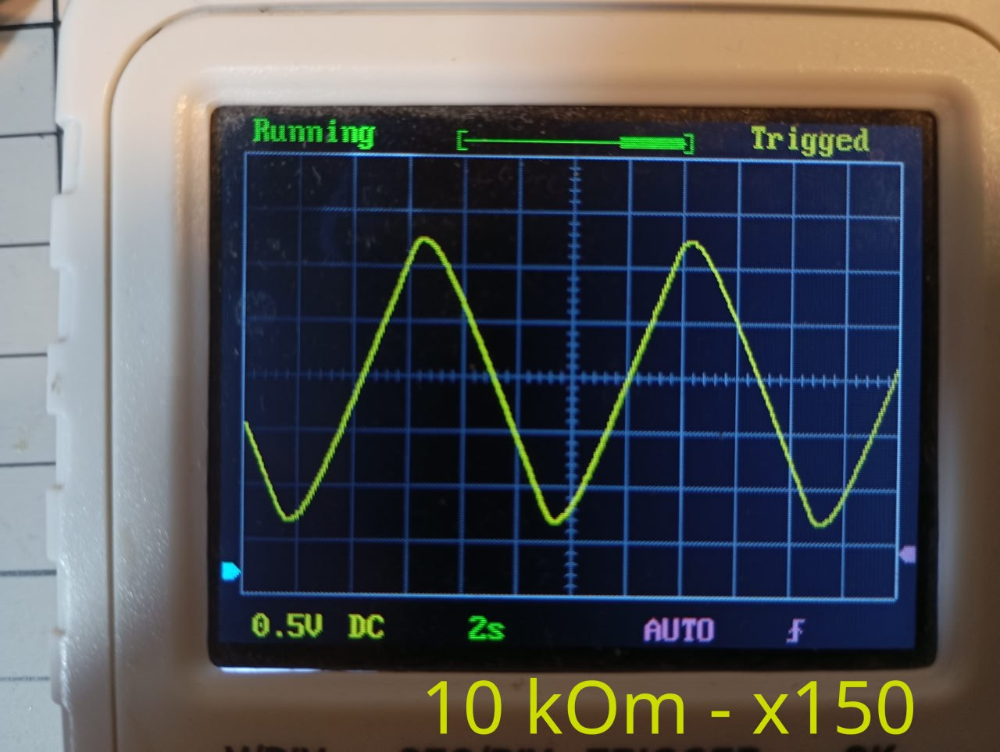
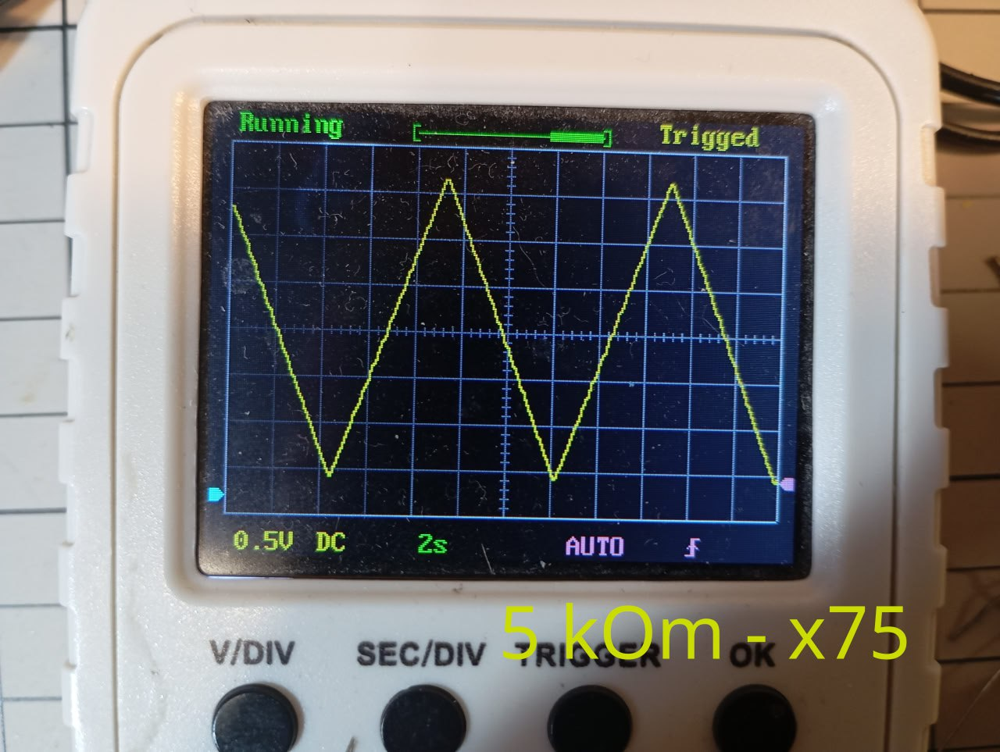
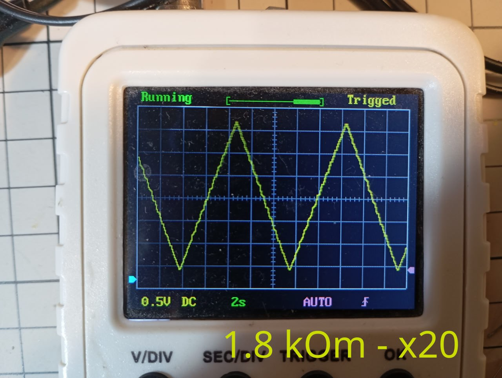
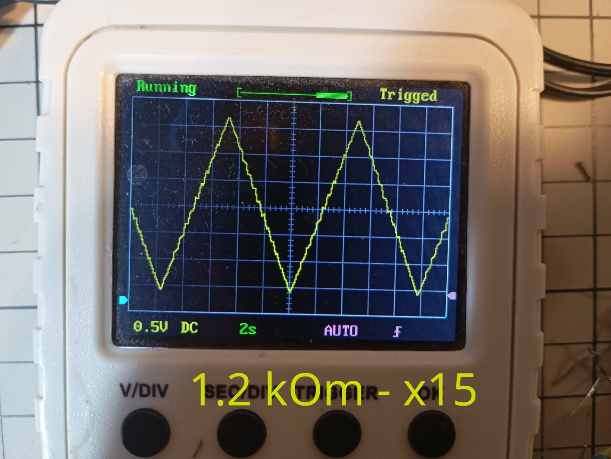
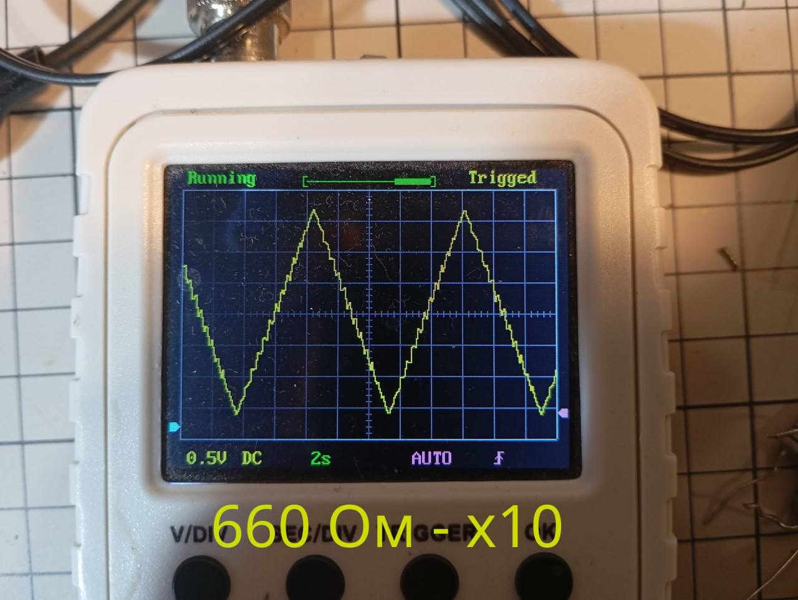
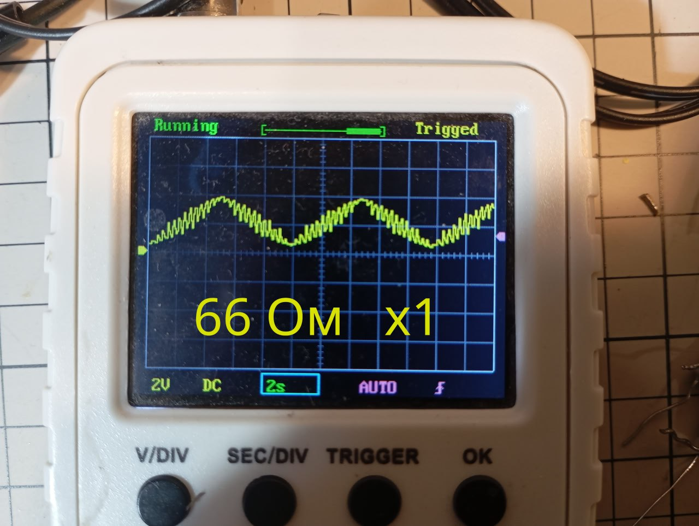

[https://habr.com/ru/companies/selectel/articles/721558/](https://habr.com/ru/companies/selectel/articles/721558/)

Суть частотного фильтра - это делитель напряжения, в котором сопротивление одного из плеч зависит от частоты.

В RC фильтре это сопротивление конденсатора = 1 / (2 * pi * f * C)

В LC фильтре это сопротивление катушки индуктивности = 2 * pi * f * L

В зависимости от того с какого из плеч снимаем напряжение - будем фильтровать низкие или высокие частоты

[https://dzen.ru/b/aAnY608UST3RVlE7](https://dzen.ru/b/aAnY608UST3RVlE7)

В прошлый раз когда искал как преобразовать ШИМ сигнал в постоянный мне как раз попался на одном из форумов совет про RC фильтр.  
Я сделал как написано - все заработало. Теперь еще раз то же самое, но с минимальными знаниями по теме.

Есть стандартный ардуиновский ШИМ сигнал ([https://gist.github.com/bakineugene/7bd84e991f221386652f8f96d734dd04](https://gist.github.com/bakineugene/7bd84e991f221386652f8f96d734dd04))  
Его частота = 490 Гц.

Нужно оставить только постоянную часть.  
Образуем делитель из конденсатора и резистора.  
Конденсатор 10 мкФ, а резистор нужно подобрать таким образом, чтобы сопротивление на конденсаторе было много меньше чем на резисторе.  

Т.е. чтобы вся переменная часть рассеивалась на резисторе.  

Вопрос только - много меньше, это сколько?  

Провел небольшой эксперимент. Чтобы получить примерно представление что к чему.  
При x20 - рябь еще видна  
При x75 - Практически ровный график  
При x150 - фильтр уже не успевает реагировать вовремя на изменение сигнала  

[Video: videos/pwm_3.mp4](videos/pwm_3.mp4)

