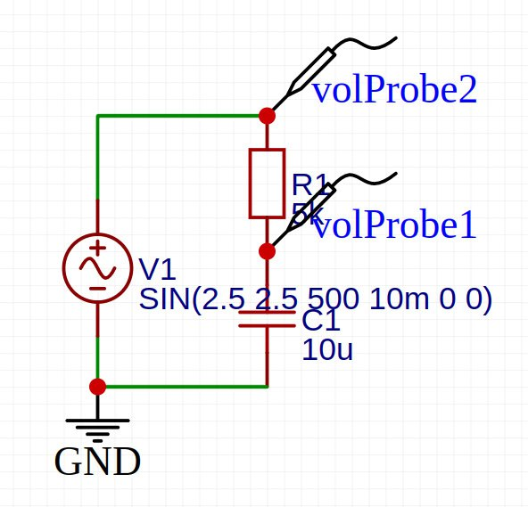
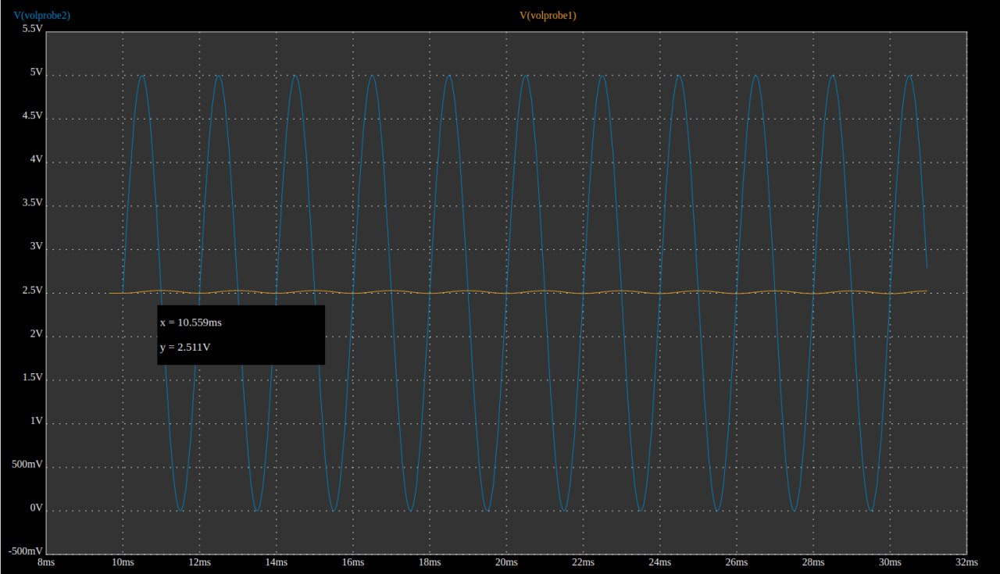
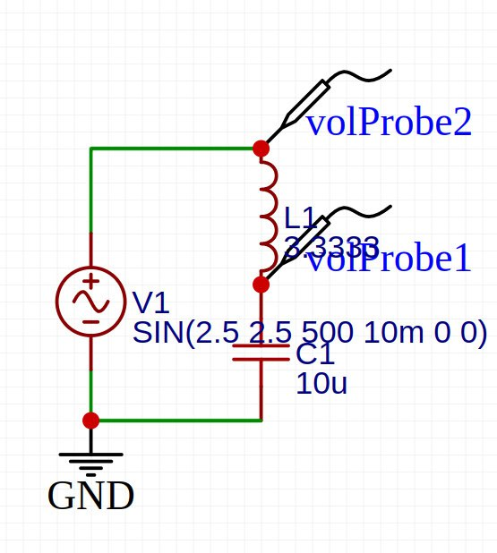
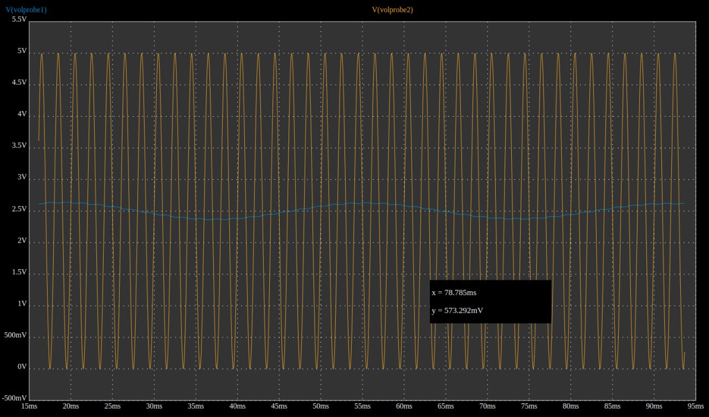
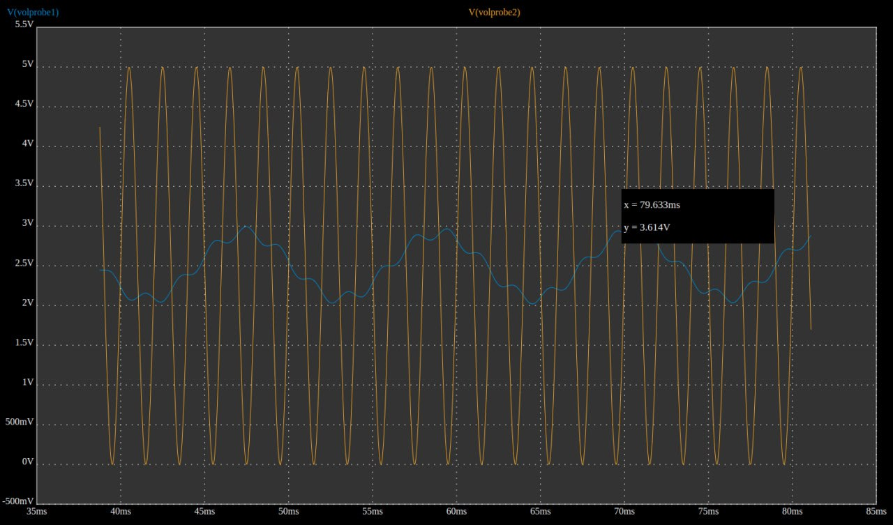
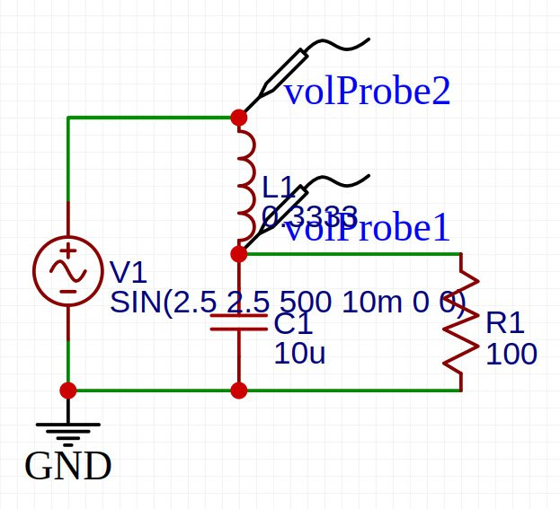
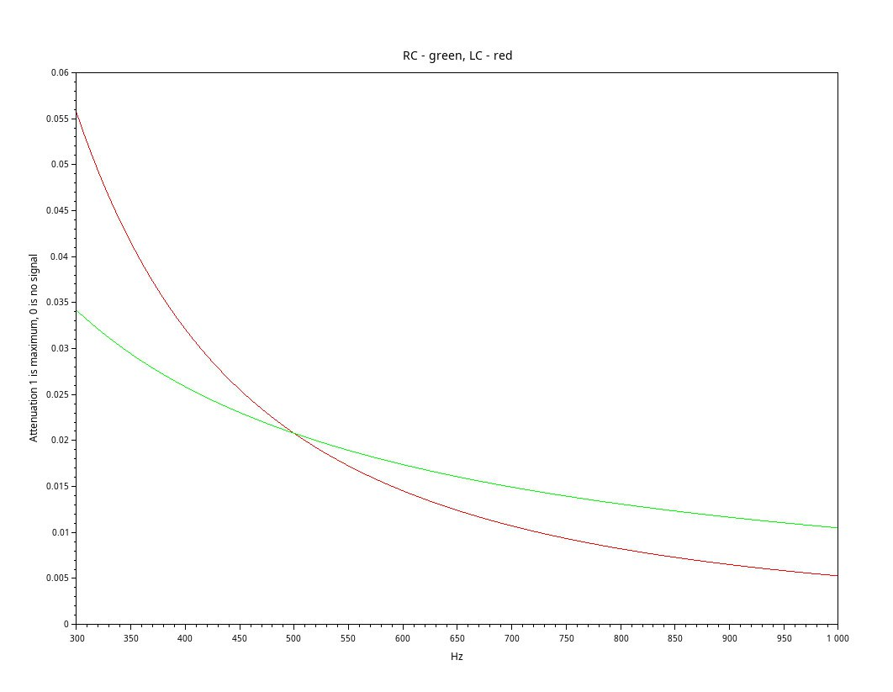

Попробовал симуляцию в EasyEDA ([https://easyeda.com/](https://easyeda.com/))

К сожалению весь обсчет идет online

Во первых, часто у меня нет ответа от сервера  
Во вторых - можно уткнуться в лимит  

А вот так ведет себя LC фильтр с частотой отсечки в 500 и 50 Гц

---

Попробовал запустить симуляцию для Т-фильтра (LCL).
Без нагрузки разницы нет, что в принципе логично.

Добавил нагрузку 100 Ом - тогда разница на лицо

---

Как мне сейчас кажется, часть Т фильтра в красном кружке (L2 + R1) - это просто второй Г фильтр.

Т.е. мы просто используем часть схемы вне фильтра как часть фильтра.

Соответственно П фильтр - это также просто два Г фильтра, но чтобы он давал какие-то преимущества нужно чтобы между L1 и V1 существовало какое-то сопротивление. Например внутреннее сопротивление источника питания.

Затухание для RC фильтра и LC фильтра
С одинаковым сопротивлением на 500 Hz

То же самое от 0

