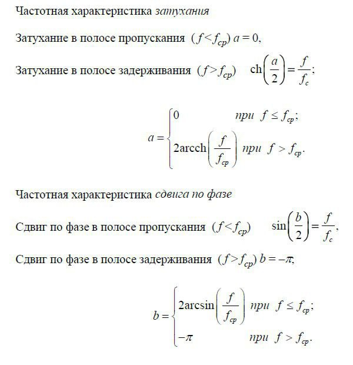
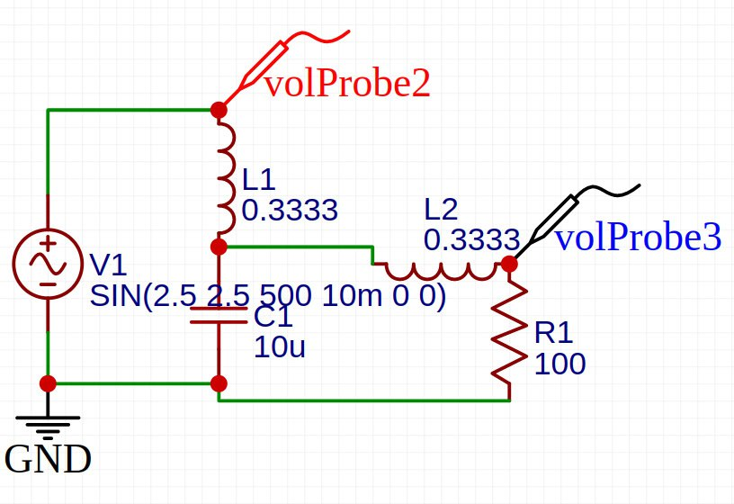
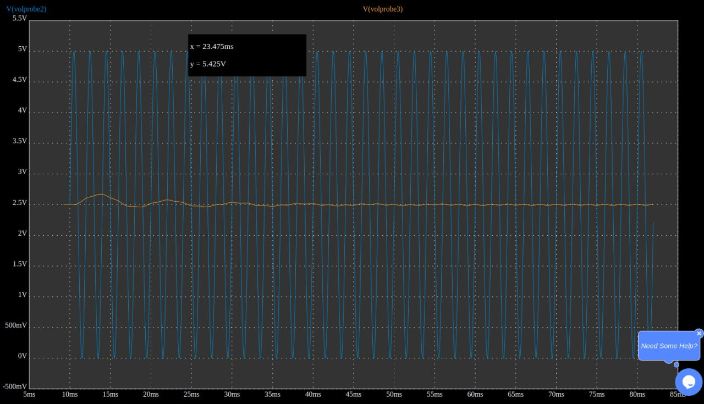
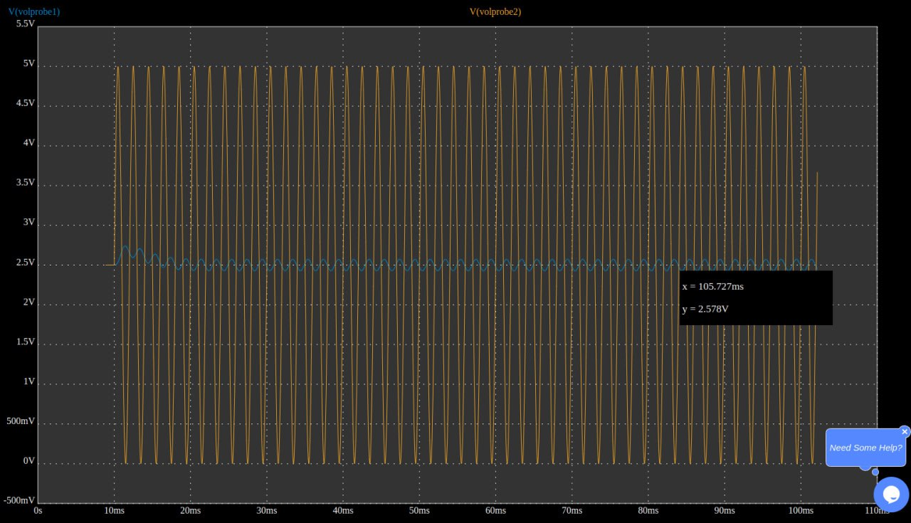
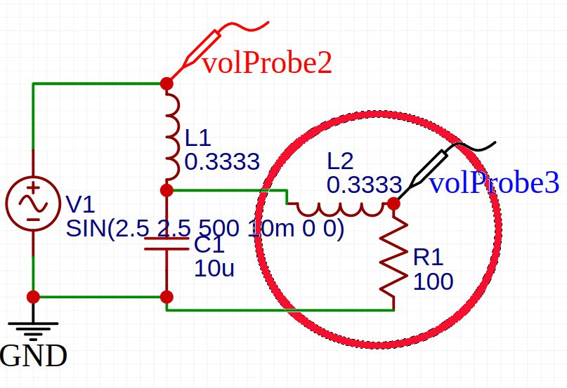
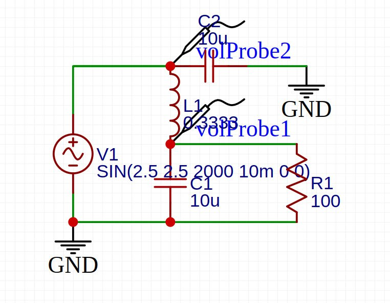
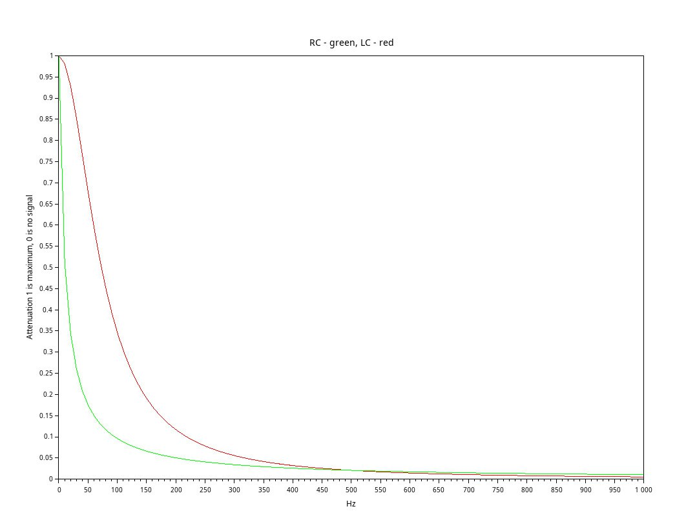

*13:24*
Попробовал симуляцию в EasyEDA ([https://easyeda.com/](https://easyeda.com/))

К сожалению весь обсчет идет online 

Во первых, часто у меня нет ответа от сервера
Во вторых - можно уткнуться в лимит

#electronics #simulation #cad

---

*13:24*  

---

*13:46*  
А вот так ведет себя LC фильтр с частотой отсечки в 500 и 50 Гц

#electronics

---

*13:46*  

---

*13:46*  

---

*16:59*  

---

*17:38*  
Попробовал запустить симуляцию для Т-фильтра (LCL).
Без нагрузки разницы нет, что в принципе логично.

Добавил нагрузку 100 Ом - тогда разница на лицо

#electronics #simulation

---

*17:38*  

---

*17:38*  

---

*17:38*  

---

*18:18*  
Как мне сейчас кажется, часть Т фильтра в красном кружке (L2 + R1) - это просто второй Г фильтр.

Т.е. мы просто используем часть схемы вне фильтра как часть фильтра.

Соответственно П фильтр - это также просто два Г фильтра, но чтобы он давал какие-то преимущества нужно чтобы между L1 и V1 существовало какое-то сопротивление. Например внутреннее сопротивление источника питания.

#electronics

---

*18:18*  

---

*22:19*  

---

*22:19*  

---

*12:10*  
Затухание для RC фильтра и LC фильтра
С одинаковым сопротивлением на 500 Hz

---

*12:12*  
То же самое от 0
