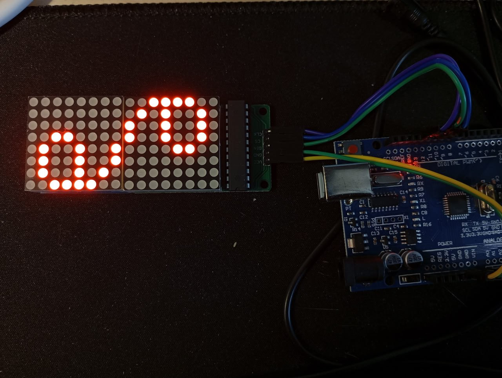
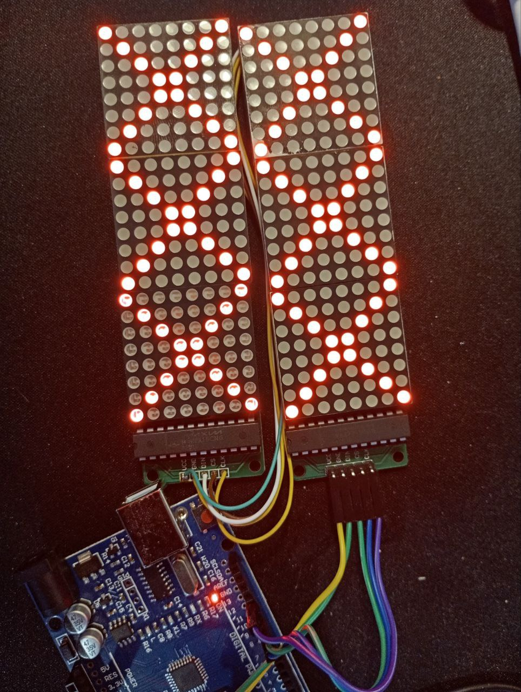

*09:01*
Небольшой сайдэффект от изучения МК. Написал десктопного сапера

[https://github.com/bakineugene/mineswipper_c/](https://github.com/bakineugene/mineswipper_c/)

---

*12:33*
[https://github.com/bakineugene/avr_max7219/](https://github.com/bakineugene/avr_max7219/)

Наковырял код из [https://embeddedthoughts.com/2016/04/19/scrolling-text-on-the-8x8-led-matrix-with-max7219-drivers/](https://embeddedthoughts.com/2016/04/19/scrolling-text-on-the-8x8-led-matrix-with-max7219-drivers/)

Теперь можно пробовать что-то рисовать на "экране".

Пока что я спаял экран из двух матриц.
Но поскольку платки у меня разнотипные - вывод на одном типе повернут на 180 градусов
Придется это скомпенсировать потом в коде

#tetris_c #max7219 #avr


---

*11:38*  
Теперь экран состоит из 6 матриц

#tetris_c #max7219 #avr


---

*13:32*  
Как это работает:

Есть три пина
Пин тактирования
Пин "включения обмена данными"
Пин данных

После включения обмена данными первый max7219 в цепочке принимает одну команду - два байта. 
Исполняет ее, а все остальное, что будет передано в этой сессии обмена данными он пересылает дальше

Поэтому обновлять за один заход можно по одному столбцу в каждой из матриц (это как раз одна команда)

В коде, который я взял за основу зачем-то отправляется noop NUM_DEVICES -1 раз и только одна команда отправляется по делу.

```cpp
void displayBuffer()
{
   for(uint8_t i = 0; i < NUM_DEVICES; i++) // For each cascaded device
   {
       for(uint8_t j = 1; j < 9; j++) // For each column
       {
           SLAVE_SELECT;

           for(uint8_t k = 0; k < i; k++) // Write Pre No-Op code
               writeWord(0x00, 0x00);

           writeWord(j, buffer[j + i*8 - 1]); // Write column data from buffer

           for(uint8_t k = NUM_DEVICES-1; k > i; k--) // Write Post No-Op code
               writeWord(0x00, 0x00);

           SLAVE_DESELECT;
       }
   }
}

```

По факту можно переписать вот так

```cpp
void displayBufferNew()
{
   for(uint8_t j = 1; j < 9; j++) // For each column
   {
       SLAVE_SELECT;

       for(uint8_t i = 0; i < NUM_DEVICES; i++) writeWord(j, buffer[j + i*8 - 1]);

       SLAVE_DESELECT;
   }
}
```

P.S.
Ну и SLAVE_SELECT, SLAVE_DESELECT  без "()" скобочек, указывающих на, то что тут-произойдет какое-то действие - глаза режет.

#tetris_c #max7219 #avr

---

*14:28*  
Немного порефакторил - в принципе с этим уже можно работать

[https://github.com/bakineugene/avr_max7219/commit/8b3c211e5bd2a33022c66e81dff41db4444783ea](https://github.com/bakineugene/avr_max7219/commit/8b3c211e5bd2a33022c66e81dff41db4444783ea)

#tetris_c #max7219 #avr