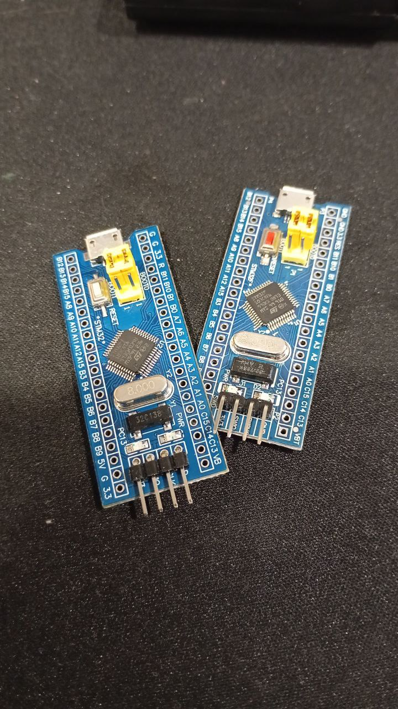

*15:55*  
#sound #avr 

Начал подключать звук.

Внезапно - на колоночке слышно, как передаются данные по spi. 😱🤔
[Video: (File exceeds maximum size. Change data exporting settings to download.)]((File exceeds maximum size. Change data exporting settings to download.))

---

*20:18*  
#sound #avr #tetris_c

Не уверен, что я подобрал правильно звуки, сын сказал, что я в стрелялки играю, а не в тетрис.

Также потратил некоторое время чтобы подобрать паузы между нажатиями кнопок. В sdl2 система событий из коробки работает практически как нужно, а тут вся моя абстракция рассыпалась. Совсем не помогает то, что джойстик на делителе напряжений. 

Если понадобится можно будет задействовать последний оставшийся таймер.

Кстати я перевел звук с таймера_1 на таймер_2, у которого пин чуть дальше, но это не помогло избавиться от "наводок". Зато оказалось, что 8 битного таймера здесь достаточно.

P.S. 

Вес прошивки вместе со звуками

```
avrdude: 14580 bytes of flash written
```
[Video: videos/video_10@12-07-2025_20-18-21_3.mp4](videos/video_10@12-07-2025_20-18-21_3.mp4)

---

*20:55*  
#sound #sdl2 #tetris_c

С sdl2 все было проще, естественно. 

Код звука и поддержки джойстика для МК приехал в одном коммите.
[https://github.com/bakineugene/tetris_c/commit/c86675465eecd939ee1b132fe6b198c86e759320](https://github.com/bakineugene/tetris_c/commit/c86675465eecd939ee1b132fe6b198c86e759320)
[Video: videos/2025-07-12_20-53-10_3.mp4](videos/2025-07-12_20-53-10_3.mp4)

---

*19:15*  
#stm32 #stm32f103c8t6

Сегодня пытался завести блинк на stm32 без IDE.

Изучать я его еще не начинал, просто хотел какой-то минимальный код для мигания светодиодом.

Они из коробки были прошиты блинком, но с моей прошивкой мигать не хотели. Уже думал, может китайцы мне брак продали. Однако заливка прошивки с одной платы на другую все оживляла.

Наконец нашел отправную точку вот в этой репе [https://github.com/m3y54m/start-stm32](https://github.com/m3y54m/start-stm32)

Теперь все мигает, как положено 🎉
