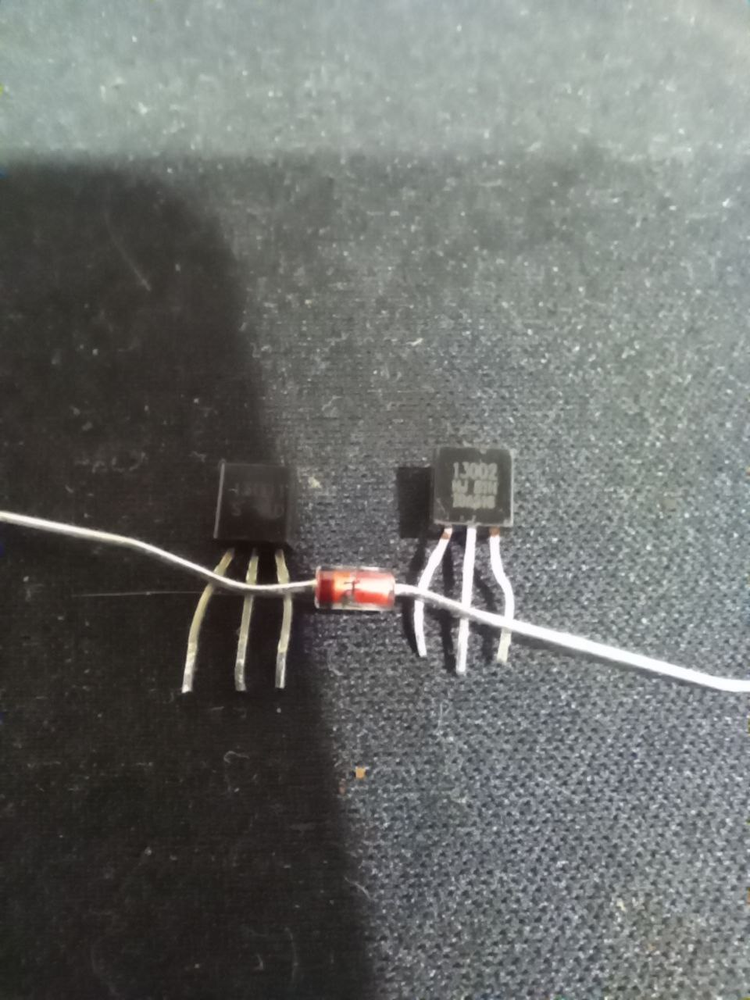
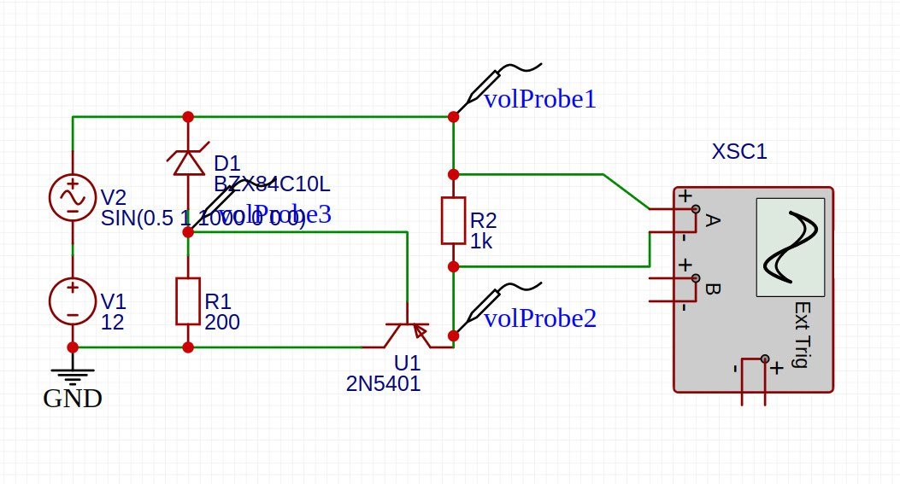
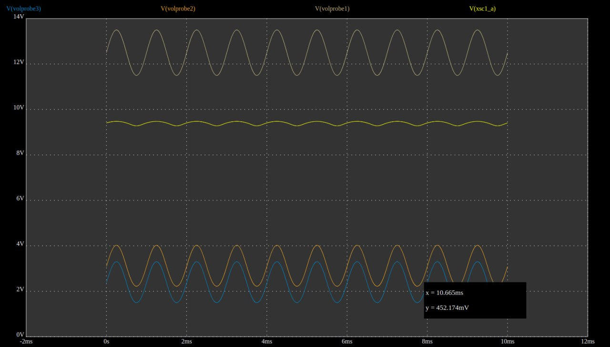
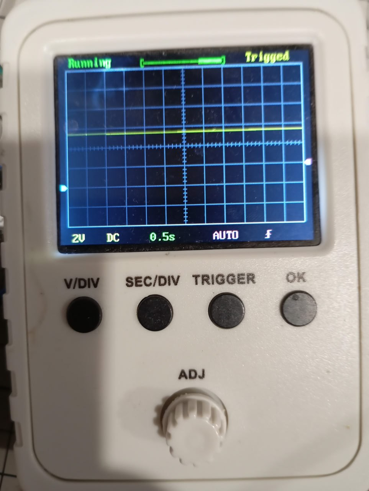
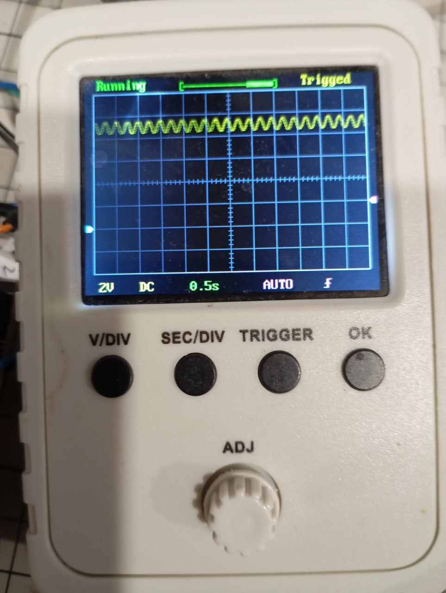
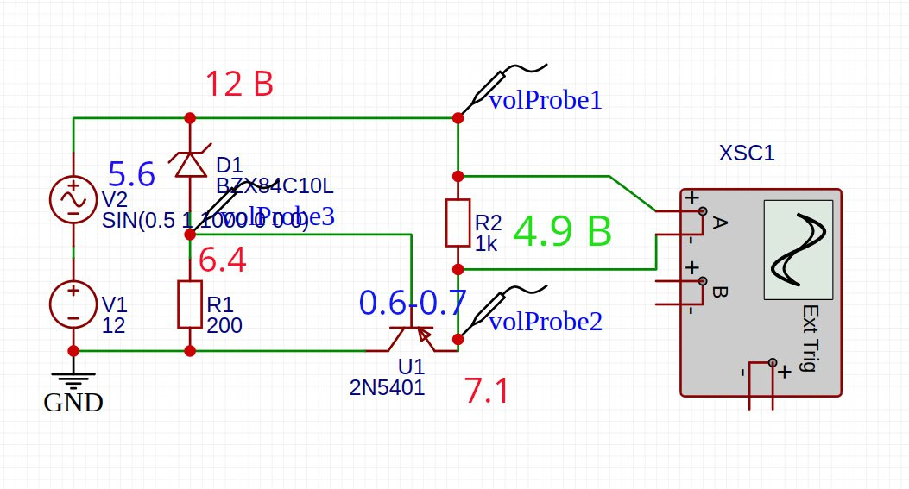

*10:17*
Эти ребята пали смертью храбрых, чтобы я что-нибудь понял про линейный стабилизатор

Press F

---

*21:34*  
#electronics

В рамках курса по электронике собрал линейный стабилизатор напряжения на pnp транзисторе 2n5401 и стабилитроне 5.5 В

Напряжение на вход подавал от 10 до 12 В + синус, на выходе держится от 4.8 до 4.9 В (5.5 - 0.7 В)

В симуляции почему-то менее красиво все, чем показывает мой осциллограф

В easy EDA сходу не нашел стабилитрон с нужными мне параметрами. Поэтому воткнул 8.4 В.

---

*21:34*  

---

*21:34*  

---

*21:34*  

---

*10:49*  
#electronics #transistor

Как это работает.

Стабилитрон - диод на котором падает заданное природой и производителем напряжение при пробое. Т.е. в данном случае он либо заперт, либо на нем падает 5.6В, третьего не дано.

Стабилитрон, таким образом, фиксирует напряжение на базе транзистора. 
U_,b = 12 - 5.6 = 6.4 В

У PNP транзистора на переходе эмиттер-база - также "стоит диод", включенный напрямую. Он также или закрыт (тогда и весь транзистор закрыт) или на нем падает 0.6 - 0.7В. 

На эмиттере напряжение должно быть выше, чем на базе - следовательно тут прибавляем U_e = 6.4 В + 0.7 В = 7.1 В

Итоговое падение напряжения на нагрузке получилось U_n = 12 - 7.1 = 4.9 В

Поскольку падение на стабилитроне и переходе ЭБ не меняются - напряжение на нагрузке также будет оставаться постоянным (5.6 - 0.7 = 4.9 В). Меняется только сопротивление самого транзистора.
