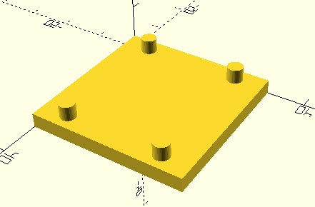
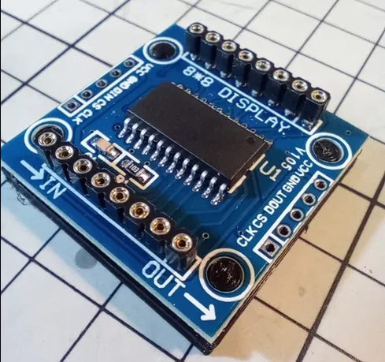

*14:30*  
#tetris_c #avr

Решения было два - либо "нарисовать" границу физически на экране, либо программно.
Второй вариант осложняется тем, что матрицы не позволяют регулировать силу свечения отдельных пикселей.

Идея заключалась в том, чтобы "мигать" пикселями достаточно быстро, чтобы казалось, что они горят в пол силы.

Заход в лоб был - обновлять экран прямо в прерывании. Что, как оказалось, плохая затея.
В итоге код "моргания" был перенесен в функцию задержки.

Решение оказалось далеко не идеальным. Сложно подобрать все так, чтобы мерцания видно не было. В некоторых случаях экран моргал так, что, полагаю, можно вызвать эпилепсию. В итоге подобрал более-менее пригодные параметры.

На видео моргания не видно, сниженную яркость не заметно. В живую чуть хуже по морганию и чуть лучше по яркости.

Для sdl2 версии - нарисовал строительную ленту.

[https://github.com/bakineugene/tetris_c/commit/48c4542721c49a8258e5aa49973532bee05b6389](https://github.com/bakineugene/tetris_c/commit/48c4542721c49a8258e5aa49973532bee05b6389)
[https://github.com/bakineugene/tetris_c/commit/205df91dee852af04335cbeeaa191876d8c6f503](https://github.com/bakineugene/tetris_c/commit/205df91dee852af04335cbeeaa191876d8c6f503)
[Video: videos/tetris_walls_avr.mp4](videos/tetris_walls_avr.mp4)

---

*14:30*  

[Video: videos/tetris_walls_sdl2.mp4](videos/tetris_walls_sdl2.mp4)

---

*12:58*  
#openscad #3dprinting

[https://github.com/bakineugene/tetris_c/commit/b5255109d299202b57873f7449b959c477de1aba](https://github.com/bakineugene/tetris_c/commit/b5255109d299202b57873f7449b959c477de1aba)

Расчехлил 3д принтер после длительного простоя.
Раньше использовал слайсер [https://slic3r.org/](https://slic3r.org/), но после смены компьютера растерял все свои настройки (Ender 3 v1). А с дефолтными он печатает очень плохо.
Раз уж такое дело - решил попробовать новые слайсеры, Slic3r уже давно не обновлялся. 
Выбор пал на PrusaSlicer [https://www.prusa3d.com/page/prusaslicer_424/](https://www.prusa3d.com/page/prusaslicer_424/) и он из коробки (есть настройки для многих принтеров) печатает гораздо лучше, чем печатало со всеми моими настройками ранее.
А также некоторые косяки Slic3r'а поправили.

Для разогрева напечатал примерочную "посадочную площадку" под одну из малых плат max7219

---

*12:58*  

