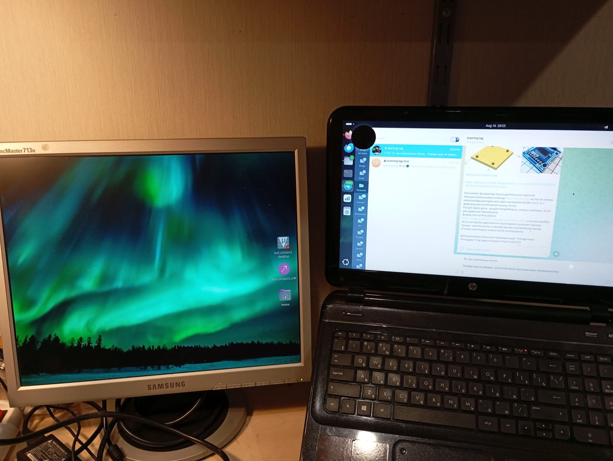
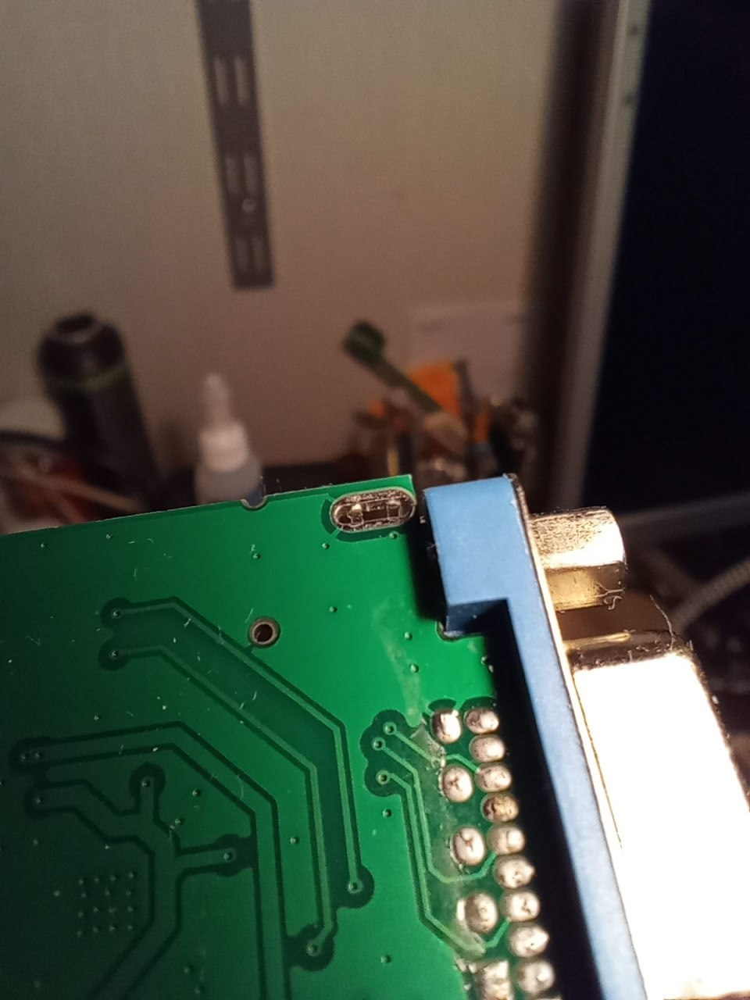

*21:22*  
TIL про земляные петли. Правда еще не уверен, что все понял.

История такая.

Захотел я себе прикупить древний квадратный монитор, которые сейчас можно почти за бесценок взять с рук. 

При покупке проверил - все ок.

Приношу домой, втыкаю (через дешевый конвертер HDMI to VGA) - на экране рябь. Расстроился, начал искать причину.
От VGA без конвертера монитор работает без ряби (но целевой ноутбук без VGA).
От другого компьютера через переходник работает без ряби.
Значит, вроде как, виноват целевой ноутбук, для которого монитор покупался.

Начинаю исследовать из-за чего.
Подключаю ноутбук к телевизору через HDMI (без переходника) - ряби нет.
Получается ноутбук обратно не виноват.
Тащу обратно - подключаю к монитору - ряби нет 🤨 

Ок, подключаю к БП - рябь появилась обратно 😭

Значит, решил я, что-то не так с питанием.
Подключил через другой БП ("псевдо-лабораторник") - рябь стала меньше, но не ушла совсем.
Тут у меня возникла гипотеза, что питание от БП как-то влияет на питание конвертера и из-за этого все беды.
Решил запитать конвертер напрямую от батарейки с линейным преобразователем.

Откусил питание, припаял проводки - для проверки подключаю 5в источник - все работает, но все равно с рябью.
Отключаю питание ноутбука - картинка пропадает, подключаю - повяляется.
Тут я пришел к выводу, что "землю" я откусил зря и теперь земля для сигнальной части теряется когда я отключаю питание ноутбука. 🫠 
Подключаю землю обратно, откушен только 5в. Подключаю "батарейку"...  и вообще никакого полезного эффекта. Рябь на месте.
Т.е. стабильные 5в не помогли.

Тут я зачем-то решил подключить монитор через ЛАТР. И рябь пропала...
Вместо ЛАТРа воткнул китайский переходник без земельного контакта - ряби нет.

Спросил ИИ - узнал про земляные петли. Не уверен, что это оно - но похоже на правду.

#ground_loop

---

*21:23*  

---

*21:23*  

[Video: videos/рябь.mp4](videos/рябь.mp4)

---

*08:30*  
[https://electronics.stackexchange.com/questions/78079/why-is-this-laptop-adapter-grounded](https://electronics.stackexchange.com/questions/78079/why-is-this-laptop-adapter-grounded)

Чуть больше информации по "земляной петле"

Во-первых про БП ноутбука:
[https://superuser.com/questions/461898/earthing-is-it-important-for-laptops/977605#977605](https://superuser.com/questions/461898/earthing-is-it-important-for-laptops/977605#977605)

Они бывают двух видов. Первого класса защиты и второго. 
БП первого класса защиты обязательно включать в розетку с заземлением. 
БП второго класса защиты можно включать без заземления.

У меня БП первого класса. "Минус" БП притянут к земле в розетке, а соответственно к земле притянут и минус питания в HDMI разъеме.

У монитора также есть "земляной" пин в вилке и корпус монитора заземлен, а также заземлен "экран" в VGA кабеле. Deepseek мамой клянется, что экран строго не должен быть соединен с "сигнальной" землей. Но в стандартах пока это найти не удалось.

 А в китайском переходнике есть вот такой интересный контакт между "экраном" и сигнальной землей. (см. картинку) Который вроде есть, но не распаян.

И как должно быть по красоте - пока непонятно

#ground_loop
