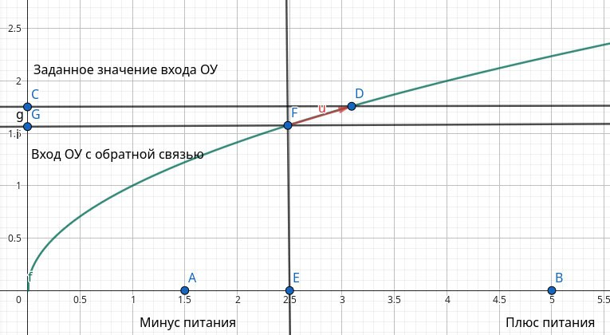
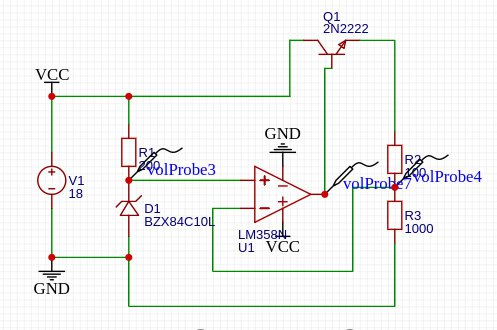

*00:04*  
После почти целого месяца прокрастинации возвращаюсь к изучению электроники
Собрал, наконец, стабилизатор напряжения на операционном усилителе и вроде бы сформировал у себя ментальную модель его работы

Операционный усилитель имеет два входа и один выход

На один вход мы подаём некоторое заданное напряжение, а второй связываем с выходом через функцию обратной связи

Можно представить некий график функции. Здесь:
C — вход с заданным значением
G — вход c сигналом обратной связи от выхода
E — сам выход

ОУ будет «пытаться» выбрать такое значение E, чтобы C−G≈0

Это похоже на метод наискорейшего спуска. Разность положительна — выход «ползёт» вверх, отрицательна — вниз, пока не достигнет равновесия

При этом действовать ОУ может только в пределах от A (минус питания) до B (плюс питания)

Один из входов инвертирующий (-), другой неинвертирующий (+). Выбор, к какому входу подключать обратную связь, определяется знаком наклона функции обратной связи, т.к. определяет "направление" движения точки E

#electronics #opamp

---

*00:29*  
Т.е. во-первых, входы нужно подключать так, чтобы при V_+ > V_- операционный усилитель повышал напряжение на выходе, чтобы уменьшить ошибку и приблизиться к равновесию.

Во-вторых, нужно учесть, что искомая точка равновесия должна находиться в рабочей области выхода ОУ. Рабочая область может быть меньше, чем диапазон питания: многие ОУ не дотягивают выход до +Vcc и до −Vcc (если это не rail-to-rail тип).

В частности если здесь вместо NPN воткнуть PNP в верхней части схемы, то интересующее нас напряжение базы будет лежать где-то в диапазоне от +Vcc до (+Vcc - 0.6). Поскольку LM358 не может поднять выход до +Vcc, то требуемая рабочая точка окажется недостижимой — и PNP не будет корректно управляться.

#electronics #opamp

---

*11:47*  
А ещё я, кажется, внезапно (снова) понял, как работает биполярный транзистор (хотя теперь не уверен что понял до конца - но точно понял, что раньше представлял себе неправильно)

До меня дошло, что в активном режиме напряжение на переходе база–эмиттер у NPN транзистора примерно фиксировано, около 0.6–0.7 В. То есть:

если Vбэ меньше порога -> транзистор закрыт
если Vбэ достиг этого уровня -> переход начинает проводить, транзистор "открывается"

Дальше ток коллектора определяется током базы (через коэффициент усиления), а напряжение коллектор–эмиттер Vкэ "подстраивается само", чтобы обеспечить этот ток
Если нагрузки "не хватает", то Vкэ вырастет - и это и есть активный режим

В схеме выше напряжение на нагрузке будет примерно равно выходному напряжению ОУ (который управляет базой) минус 0.6–0.7 В