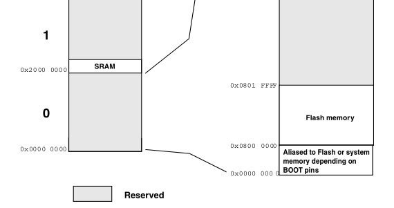
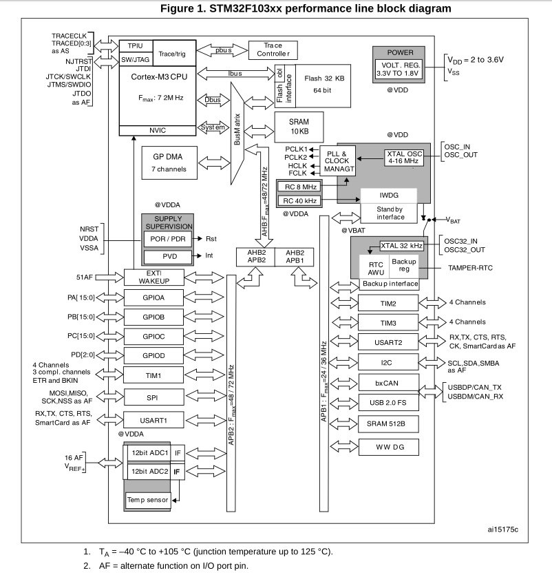
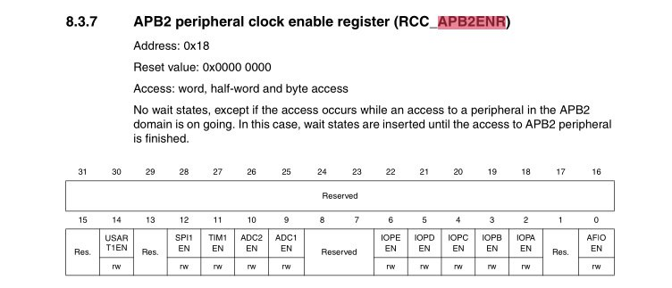
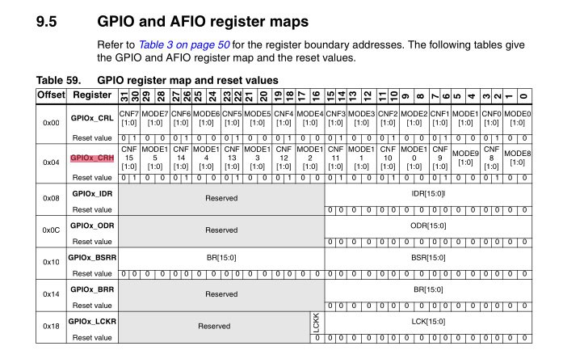
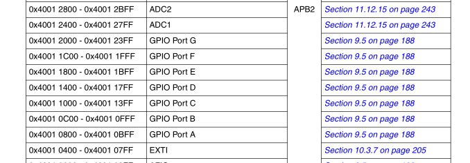

*16:08*  
Закончился первый модуль курса по C++ от Яндекс.Практикум

[https://practicum.yandex.ru/cpp/](https://practicum.yandex.ru/cpp/)

Сначала думал, что будет слишком легко и надо было сразу брать продвинутый, но нагрузка оказалась приличной. Вместе с работой едва успевал (даже сюда писать перестал), но за дедлайн не вышел

Первый модуль занимает 2.5 месяца + неделя каникул
Темы: Весь базовый синтаксис + перегрузка функций и операторов, constexpr, шаблоны, лямбды, базовые STL контейнеры и алгоритмы, исключения + совсем немного по паттернам и тестам

Кроме того, один спринт отводится на изучение Qt ([https://doc.qt.io/](https://doc.qt.io/))

От Qt у людей пригорает, потому что мало того что тебе дают изучать язык, так еще и сверху Qt, у которого все свое (своя имплементация строк, контейнеров, итераторов, etc). Меня лично бесила необходимость рисовать интерфейсы

Но как первый фреймворк для изучения — он очень хорош. Batteries included, куча модулей на любой вкус и цвет

Работа с UI в Qt немного не в тренде. Вместо декларативного подхода все еще используется императивный, или, как вариант, можно накликать интерфейс в конструкторе

Собирается все без проблем и под Linux, и под Windows. Вроде как даже под Android можно собрать приложеньку, хотя с ходу я не понял как

Для установки под Windows придется пройти квест или купить VPN, потому что Qt не хочет обслуживать людей из РФ.
А под Ubuntu просто sudo apt-get install qt6-base-dev qtcreator

#cpp #qt

---

*23:34*  
Как результат первого модуля написал на Qt простенькое приложение-тренер для занятий йогой (ну и чем угодно на самом деле). Таких немало в google play store, но там реклама. Поэтому почему бы не написать свое в качестве упражнения

[https://github.com/bakineugene/yogapp](https://github.com/bakineugene/yogapp)

Набор упражнений задается через класс YogaSequence ([https://github.com/bakineugene/yogapp/blob/main/yogasequence.h](https://github.com/bakineugene/yogapp/blob/main/yogasequence.h)). Само упражнение задается через пару `using YogaPose = std::pair<std::string, int>`, определяющую название (для путей к ассетам) и время на упражнение

На классе определены методы переключения вперед и назад по упражнениям. Упражнение переключится автоматически если выполнено два условия — закончило звучать звуковое сопровождение И истекло время на упражнение

Текущий элемент определен через итератор. Мне почему-то очень понравились итераторы — в C++ это основной инструмент работы с коллекциями. С помощью итератора можно перемещаться по коллекции, а также получить текущий объект разыменованием `*iterator` (да, как с указателями). Но у них есть минус — итератор может «протухнуть», и пользователь об этом узнает только попытавшись разыменовать. Так что разбрасываться итераторами нельзя — ими может безопасно пользоваться только тот, кто владеет коллекцией (AFAIK)

Класс окошка ([https://github.com/bakineugene/yogapp/blob/main/mainwindow.cpp](https://github.com/bakineugene/yogapp/blob/main/mainwindow.cpp)) реализует работу таймера, плеера и отрисовки изображений

player:
```cpp
   player_.setAudioOutput(&audio_output_);
   connect(&player_, &QMediaPlayer::mediaStatusChanged,
            this, &MainWindow::OnPlayerFinish);

   player_.setSource(QUrl{path});
   player_.play();
```

timer:
```cpp
    connect(&timer_, &QTimer::timeout, this, &MainWindow::OnTimer);
    timer_.setInterval(pose.second);
    timer_.start();
```

Функция `connect` подписывает коллбек/хендлер (например OnTimer) на событие (например timeout). Так бы сказали фронтендеры. Но в Qt придумали свои названия — OnTimer это «слот», а timeout это «сигнал». Не то чтобы очень важно, но интересно, что тут совсем другая терминология

Картинки нарисовала Алиса, а текст озвучил яндексовый спичкит.

#cpp #qt #yoga

---

*23:36*  

[Video: (File exceeds maximum size. Change data exporting settings to download.)]((File exceeds maximum size. Change data exporting settings to download.))

---

*23:36*  


---

*16:50*  
Интересную методику прочел про "промптинг" для ИИ.

Мета-промпт ([https://www.gptunnel.ru/en/guide/meta-prompting](https://www.gptunnel.ru/en/guide/meta-prompting))

Вместо того, чтобы сочинять промпт - можно сочинить промпт, чтобы ИИ сам сочинил промпт 🤣

```
# Роль
Старший разработчик.

#Контекст
Собираешься выполнить задачу по разработке бота для телеграм и воспользоваться для этой цели ИИ.

# Задача
Создать простой телеграм-бот для управления таймерами.

# Технические требования
Язык программирования: Python 3.11.
Библиотека: aiogram (для работы с Telegram API).

# Функциональность
Команда /timer 10m — запускает таймер на 10 минут и отвечает «Таймер на 10 минут установлен».
Команда /cancel — отменяет активный таймер и отвечает «Таймер отменён».
По истечении времени бот автоматически пишет «Время вышло!».

# Ограничения
таймеры должны храниться в памяти (без использования базы данных).

# Задача
Составь промпт для ИИ бота в XML формате чтобы получить желаемый результат
```

XML формат - тоже интересный элемент. Так финальный промпт легче копировать

Ну и, кстати, с написанием бота справилась даже Алиса/YandexGPT, хотя по моим субъективным оценкам она пока не дотягивает до deepseek/qwen

Бота можно тут потрогать, пока я его не снес @bakin_test_bot

P.S. Хотя даже в такой задаче ИИ сумел накосячить, но хоть как-то работает 🤣

#ai #telegram

---

*22:50*  
Разбираюсь с кодом инициализации stm32 (форкнул репозиторий из поста выше [https://github.com/bakineugene/stm32-blink/](https://github.com/bakineugene/stm32-blink/))

1. Есть datasheet, а есть reference manual.
В частности для STM32F103xx (STM32F103C6, STM32F103C8, STM32F103CB) нужен reference manual RM0008.

```
This reference manual targets application developers. It provides complete information on how to use the STM32F101xx, STM32F102xx, STM32F103xx and STM32F105xx/STM32F107xx microcontroller memory and peripherals.
```

Т.е. для разработки нужен RM, а за какой-то спецификой RM посылает в datasheet конкретной модели.

2. вот эти адреса, что указаны в `linker.ld`

```
MEMORY
{
  FLASH (rx) : ORIGIN = 0x08000000, LENGTH = 32K
  RAM (xrw)  : ORIGIN = 0x20000000, LENGTH = 10K
}
```
Они указаны в разделе memory map в даташите конкретной модели. На скриншоте можно найти данные для STM32F103C6

3. Все начинается с инициализации периферии

```
The STM32F103x4 and STM32F103x6 performance line family incorporates the high-performance ARM® Cortex™-M3 32-bit RISC core operating at a 72 MHz frequency, high-speed embedded memories (Flash memory up to 32 Kbytes and SRAM up to 6 Kbytes), and an extensive range of enhanced I/Os and peripherals connected to two APB buses. All devices offer two 12-bit ADCs, three general purpose 16-bit timers plus one PWM timer, as well as standard and advanced communication interfaces: up to two I2Cs and SPIs, three USARTs, an USB and a CAN.
```

Периферия - это все, что не память и CPU. GPIO порты, таймеры, ADC, i2c, spi, usart и вообще все встроенное в чип, что может предложить конкретная модель stm32.

Вся периферия подключена через шины AHB и APB. Первая Advanced High-Performance Bus, вторая Advanced Peripheral Bus.

Для того чтобы работать с каким-то элементом периферии - его нужно настроить. Как минимум включить. По умолчанию все выключено. 
Включить периферию - означает "затактировать" ее. Т.е. начать подавать на нее тактирующие импульсы. После чего можно настроить работу самой периферии.

4. Memory Map

Для настройки мы обращаемся к некоторым блокам памяти, называемым регистрами. В STM32 регистры периферии обычно имеют размер 32 бита.

Регистры объединены в логические блоки. Начало каждого блока регистров (его адрес) можно найти в разделе `3.3 Memory map` документа RM0008.

Например для настройки тактирования периферии используется блок регистров RCC (`0x40021000` - `Reset and clock control`). 

Пожалуй все на сегодня.

#stm32 #cmsis

---

*22:51*  



---

*22:52*  



---

*22:52*  


---

*22:52*  


---

*12:40*  
Идем дальше 

```c
#define RCC_BASE 0x40021000

#define RCC_APB2ENR *(volatile uint32_t *)(RCC_BASE + 0x18)
#define RCC_IOPCEN (1 << 4)

RCC_APB2ENR |= RCC_IOPCEN;
```

Откуда взялся RCC_BASE - уже понятно.

Поскольку задача - мигать встроенным в BluePill светодиодом (GPIOC 13), а GPIOx подключены к APB2 - нам нужен регистр управления тактированием для APB2 - называется RCC_APB2ENR.

Как видно тут можно сконфигурировать 5 портов - A, B, C, D, E. Но на самой blue pill светодиод подписан как PC13. Так понимаем, что он относится к порту C.

С этой схемы мы берем и 0x18 адрес регистра в блоке и смещение 4 для IOPC_EN

Переключая IOPC_EN в 1 - включаем тактирование для GPIOC порта

#stm32 #cmsis


---

*23:09*  
Добрались до регистров, работающих с пинами.

**CRL, CRH** (Configuration Register Low/High)
Первый отведен под конфигурацию для пинов с 0 по 7, второй для пинов с 8 по 15

Позволяет задать MODE (режим) 
```
00: Input mode (reset state)
01: Output mode, max speed 10 MHz.
10: Output mode, max speed 2 MHz.
11: Output mode, max speed 50 MHz.
```
Еще два бита позволяют задать конфигурацию
```
Для выхода (Output):
00: Push-Pull - можем подтянуть к земле/питанию
01: Open-Drain можем подтянуть к земле/подвесить в воздухе
```

Таким образом здесь ([https://github.com/bakineugene/stm32-blink/blob/master/blinky-no-lib/src/main.c](https://github.com/bakineugene/stm32-blink/blob/master/blinky-no-lib/src/main.c))

Мы берем адрес блока регистров GPIOC из таблицы (0x40011000)
Добавляем оффсет для GPIOx_CRH (0x04)
CRH - т.к. там лежат настройки 13 пина

```c
GPIOC_CRH &= 0xFF0FFFFF;
GPIOC_CRH |= 0x00200000;
```
`0x2 == 0b0011`
`00 == push-pull`
`11 == выход, частота 50 МГц`

И устанавливаем для 13 пина режим "выход" + push-pull. Для целей мигания светодиодом подойдет любой из "выходных" режимов.

#stm32 #cmsis


---

*23:09*  



---

*23:34*  
Ну и еще два интересных порта (хотя для мигания на самом деле один)

```
Port input data register (GPIOx_IDR) (x=A..G) Address offset: 0x08h
Bits 15:0 IDRy[15:0]: Port input data (y= 0..15)

Port output data register (GPIOx_ODR) (x=A..G) Address offset: 0x0C
Bits 15:0 ODRy[15:0]: Port output data (y=0..15)
```

IDR - для чтения (input)
ODR - для записи (output)

Для мигания мы используем 13 бит "выходного" регистра.
```c
#define GPIOC_ODR *(volatile uint32_t *)(GPIOC_BASE + 0x0C)

#define GPIOC13 (1UL << 13)

GPIOC_ODR |= GPIOC13;
for (int i = 0; i < 500000; i++)
; // arbitrary delay

GPIOC_ODR &= ~GPIOC13;
for (int i = 0; i < 500000; i++)
; // arbitrary delay
```

Итого: платка опять мигает как и в прошлый раз.
Но теперь я понимаю что там происходит. Так что теперь я залил ту же прошивку, но с уважением =)

#stm32 #cmsis
[Video: (File exceeds maximum size. Change data exporting settings to download.)]((File exceeds maximum size. Change data exporting settings to download.))

---

*23:35*  


---

*12:25*  
Следующий шаг - SPL (Standard Peripheral Library)

В каком-то виде можно найти на гитхабе, но там структура немного отличается 
[https://github.com/dcmde/stm32f103_spl](https://github.com/dcmde/stm32f103_spl)
[https://github.com/Derppening/stm32f103](https://github.com/Derppening/stm32f103)

Можно пройти квест с VPN и регистрацией и скачать у ST

[https://www.st.com/en/embedded-software/stsw-stm32054.html#get-software](https://www.st.com/en/embedded-software/stsw-stm32054.html#get-software)

#stm32 #spl #stm32f10x


---

*12:55*  
Discovering the STM32 Microcontroller

Достаточно глубокая, но доступная книга по SPL для STM32F1xx. Примечательно использование GNU Linux тулчейна.

---

*11:43*  
Хотя прошлые посты я пометил как #cmsis - оказалось, что это не совсем корректно.

CMSIS это набор стандартов для разработки кода под Cortex-M микроконтроллеры ([https://www.arm.com/technologies/cmsis](https://www.arm.com/technologies/cmsis)).

Т.е. включает в себя в том числе и набор инструментов для бутстрапа ([https://github.com/Open-CMSIS-Pack/cmsis-toolbox/blob/main/README.md](https://github.com/Open-CMSIS-Pack/cmsis-toolbox/blob/main/README.md))

Со стороны ST есть как адаптация армового репозитория под нужды stm32 ([https://github.com/STMicroelectronics/cmsis-core](https://github.com/STMicroelectronics/cmsis-core))
Так и наборы "расширений" для конкретных семейств микроконтроллеров

Эти репозитории могут как использоваться самостоятельно, так и в рамках более масштабного иструмента под названием Stm32Cube ([https://github.com/STMicroelectronics/STM32CubeF1](https://github.com/STMicroelectronics/STM32CubeF1))

Конкретно cmsis репозитории ([https://github.com/STMicroelectronics/cmsis-device-f1](https://github.com/STMicroelectronics/cmsis-device-f1)) содержат:
1. Скрипт для линкера
2. Ассемблерный код для инициализации микроконтроллера
3. C код инициализации
4. Макросы и определения с адресами блоков регистров, регистров и бит

#cmsis #stm32
