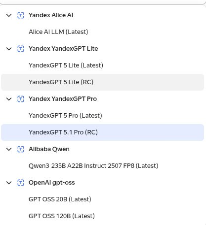

*01:27*  
btw

Можно получить полноценного AI агента с помощью расширения для VSCode ([https://sourcecraft.dev/portal/code-assistant/](https://sourcecraft.dev/portal/code-assistant/))
И далее либо подключить дефолтного в sourcecraft ([https://sourcecraft.dev/me/codeassistant/settings](https://sourcecraft.dev/me/codeassistant/settings))

Либо завести одного из доступных в Yandex.Cloud ([https://yandex.cloud/ru/docs/ai-studio/tutorials/ai-model-ide-integration](https://yandex.cloud/ru/docs/ai-studio/tutorials/ai-model-ide-integration))

#ai
