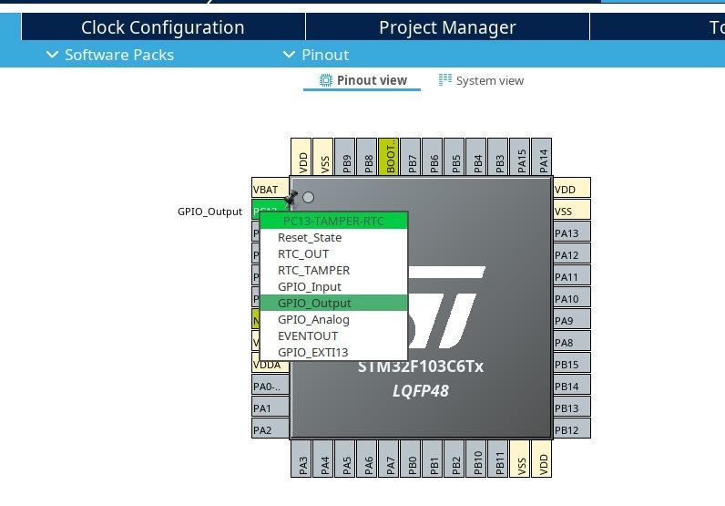

*12:20*  
[https://github.com/bakineugene/stm32-f1-spl-blink/blob/main/main.c](https://github.com/bakineugene/stm32-f1-spl-blink/blob/main/main.c)

"Мигалка" на spl

```c
int main(void) {
    RCC_APB2PeriphClockCmd(RCC_APB2Periph_GPIOC, ENABLE);

    GPIO_InitTypeDef gpio;
    gpio.GPIO_Pin   = GPIO_Pin_13;
    gpio.GPIO_Mode  = GPIO_Mode_Out_PP;   // Push-pull
    gpio.GPIO_Speed = GPIO_Speed_2MHz;

    GPIO_Init(GPIOC, &gpio);

    while (1) {
        GPIO_ResetBits(GPIOC, GPIO_Pin_13);
        delay(5000000);

        GPIO_SetBits(GPIOC, GPIO_Pin_13);
        delay(1000000);
    }
```

Прошивка занимает 2.4 Kb против примерно 1 Kb для чистого CMSIS

SPL при этом поставляется вместе с CMSIS, но поскольку SPL официально больше не поддерживается; версия, которая поставляется с SPL-пакетом, устарела (а важно ли это вообще?).

Каждый элемент периферии поддержан в отдельном "модуле" SPL, который нужно подключать отдельно. В данном случае использованы gpio и rcc.

При этом SPL по дефолту, похоже, устанавливает частоту работы 72Mhz и чтобы версия на cmsis соответствовала - пришлось нагенерировать еще кода ([https://github.com/bakineugene/stm32-f1-cmsis-blink/commit/12682b2b6d1edecfba93ae0f2969d8f63a92226e](https://github.com/bakineugene/stm32-f1-cmsis-blink/commit/12682b2b6d1edecfba93ae0f2969d8f63a92226e))

#stm32 #spl #cmsis

---

*23:49*  
Современные альтернативы SPL - HAL и LL

По идее лежат в репозиториях по типу вот этого ([https://github.com/STMicroelectronics/stm32f1xx-hal-driver](https://github.com/STMicroelectronics/stm32f1xx-hal-driver)), и также представляют собой отдельные модули для каждого элемента периферии. Насколько я понимаю можно пользоваться прямо так.

Сегодня я добрался до Stm32 Cube MX - [https://www.st.com/en/development-tools/stm32cubemx.html](https://www.st.com/en/development-tools/stm32cubemx.html). Инструмента, который позволяет забутстрапить проект (на основе HAL или LL) для любого доступного MCU натыкав нужное в графическом интерфейсе. Есть вариант сгенерировать Makefile, который сходу работает.  

Получился вот такой проектик.
[https://github.com/bakineugene/stm32-f1-cubemx-hal-blink/blob/main/Core/Src/main.c](https://github.com/bakineugene/stm32-f1-cubemx-hal-blink/blob/main/Core/Src/main.c)

Единственный прикол, который я словил - почему то прошивку, сгенерированную этим проектом, нужно перезатирать удерживая reset, иначе "unable to connect to the target" - пока еще не понял в чем причина.

P.S. Размер blink прошивки с HAL - 3.5Kb

#stm32 #hal #ll #cubemx
