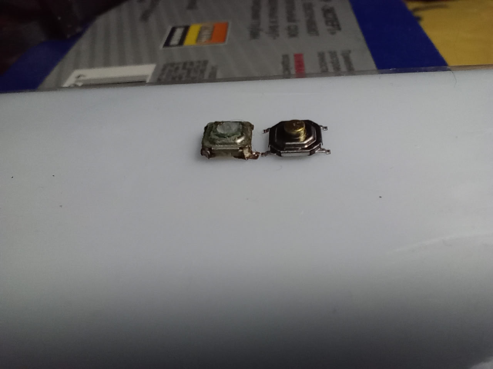

*01:02*  
Сегодня ремонтировал зубную щётку (Oral-B Braun).

Перестала нажиматься тактовая кнопка.

Сам ремонт показывать не буду — там всё пошло криво. Оторвал дорожку, пришлось восстанавливать.

Кнопку поставил из китайского набора, сколько проживёт — не знаю.

Интересно, что оригинальная кнопка низкопрофильная — почти вровень с площадкой.

#repair

---

*09:41*  
[https://habr.com/ru/companies/timeweb/articles/787328/](https://habr.com/ru/companies/timeweb/articles/787328/)

Статейка про настройку среды для работы с STM32 под linux

Я уже забыл, что конкретно ставил

Плюс дебаггер я так и не настраивал

#stm32 #linux