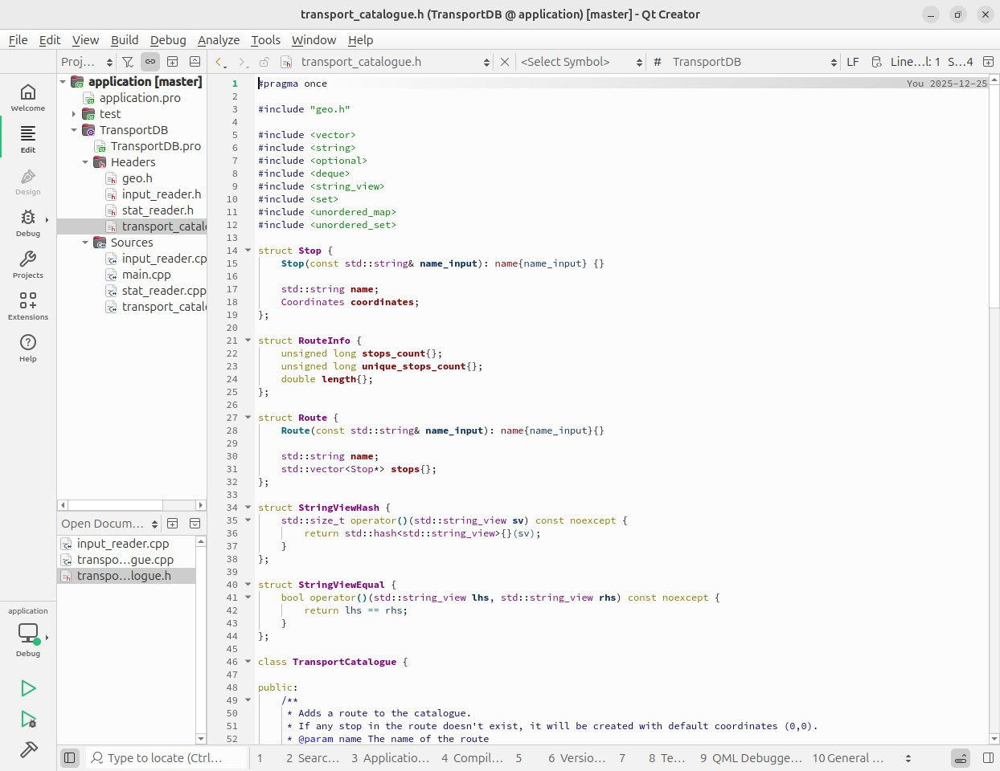
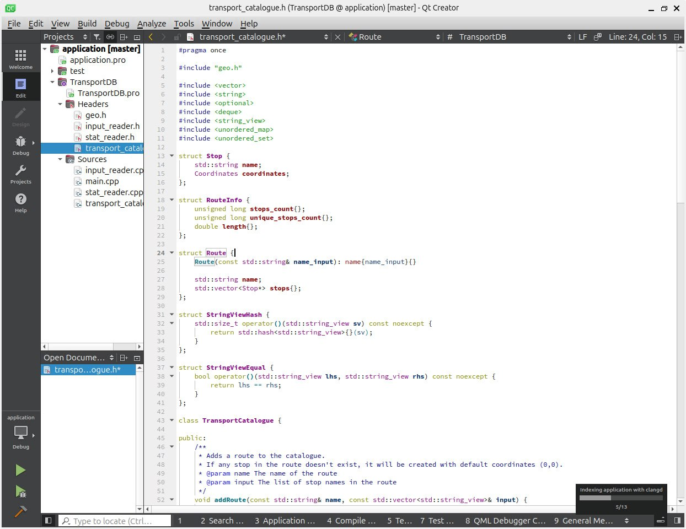

*14:32*  
На этой неделе в основном догонял материал по C++ курсу.

И у меня стал стабильно падать QtCreator, которым меня в рамках этого курса приучили пользоваться.

QtCreator версии 13, той, что идет в комплекте с Ubuntu 24.04. 
Падает, судя по всему, где-то на стыке с clangd во время парсинга файлов.
Честно пытался поймать ошибку, но она, видимо, специально возникает только в те моменты, когда я давно изменения не сохранял.
LLM утверждает, что были изменения в API clangd и нужно просто обновиться.

Обновился до 18 версии ([https://github.com/qt-creator/qt-creator/releases/tag/v18.0.1](https://github.com/qt-creator/qt-creator/releases/tag/v18.0.1))

Причем, что "интересно", до этого я проходил курс по C, и там уроки были в code::blocks. И у него тоже стабильно крашилась версия из репозитория: начинает криво рисовать строку под курсором и все - до свидания. Тоже потребовалось обновиться на внешнюю версию.

И это притом, что версии в репозитории лочатся именно для того, чтобы получить более стабильный UX 🙄

#rant

---

*14:32*  

