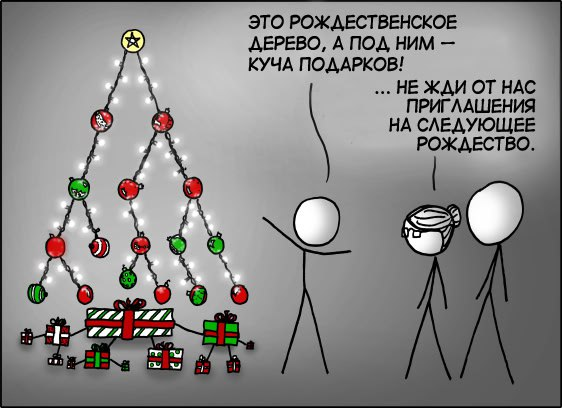

*22:48*  
Часть №2 Правило трех

[https://gist.github.com/bakineugene/4d493b8ad4f3f189bcfb5247a43544b1/8557ce0d466cac525a28e26a66cae34a78a650a6](https://gist.github.com/bakineugene/4d493b8ad4f3f189bcfb5247a43544b1/8557ce0d466cac525a28e26a66cae34a78a650a6)

Итак, у нас есть класс для управления памятью с помощью RAII паттерна.

Однако сейчас он небезопасен для использования. При присваивании или использовании конструктора копирования произойдет поверхностное копирование: во второй объект просто будет скопирован тот же указатель на память. И при разрушении обоих объектов произойдет двойное освобождение памяти.

```c++
SimpleArray<int> array(100);
SimpleArray<int> array_2{array};
```
или
```c++
SimpleArray<int> array(100);
SimpleArray<int> array_2;
array_2 = array;
```

Приведет к:

```shell
free(): double free detected in tcache 2
Aborted (core dumped)
```

По этой причине сформулировано "правило трех" (на самом деле - правило пяти, но об этом позже).
[https://en.cppreference.com/w/cpp/language/rule_of_three.html](https://en.cppreference.com/w/cpp/language/rule_of_three.html)

Если определен деструктор - скорее всего, также нужно определить конструктор копирования ([https://en.cppreference.com/w/cpp/language/copy_constructor.html](https://en.cppreference.com/w/cpp/language/copy_constructor.html)) и оператор копирования ([https://en.cppreference.com/w/cpp/language/as_operator.html](https://en.cppreference.com/w/cpp/language/as_operator.html)). Итого 3!
Копирование в таких классах должно быть "глубоким", с выделением нового блока памяти и копированием всех данных.

```c++
    SimpleArray(const SimpleArray<T>& other):
        memory_{new T[other.size_]},
        size_{other.size_} {

        std::copy(other.memory_, other.memory_ + size_, memory_);
    }

    ~SimpleArray() {
        delete[] memory_;
    }

    SimpleArray& operator=(const SimpleArray<T>& other) {
        if (this == &other) {
            return *this;
        }

        T* memory_copy = new T[other.size_];
        std::copy(other.memory_, other.memory_ + other.size_, memory_copy);

        size_ = other.size_;
        delete[] memory_;
        memory_ = memory_copy;

        return *this;
    }
```

#cpp #memory

---

*13:21*  
Часть №2.5 Лишние копирования

Теперь класс ведет себя корректно при присваивании и копировании. Однако мы получаем лишние копирования в ситуациях, когда задействованы "временные" короткоживущие объекты.

Это должно было быть начало части 3, но я подзастрял с демонстрацией лишних копирований. Оказалось, что добиться их не так просто из-за оптимизаций, избегающих копирования - copy elision ([https://en.cppreference.com/w/cpp/language/copy_elision.html](https://en.cppreference.com/w/cpp/language/copy_elision.html))

Я хотел продемострировать лишнее копирование, добавив оператор `+`, объединяющий два массива, а также добавив логирование в конструктор копирования и оператор копирующего присваивания:
```c
    SimpleArray<T> operator+(const SimpleArray<T>& other) const {
        SimpleArray<T> result(size_ + other.size_);
        std::copy(memory_, memory_ + size_, result.memory_);
        std::copy(other.memory_, other.memory_ + other.size_, result.memory_ + size_);
        return result;
    }
```
 
Место вызова:
```c++
    SimpleArray<int> array_4 = array_2 + array_3;
```

Однако в этом случае они не вызываются из-за NRVO (Named Return Value Optimization). Вместо создания временного объекта компилятор конструирует объект сразу в памяти, зарезервированной для возвращаемого значения.

```
In a return statement in a function with a class return type, when the operand is the name of a non-volatile object obj with automatic storage duration (other than a function parameter or a handler parameter), the copy-initialization of the result object can be omitted by constructing obj directly into the function call’s result object. This variant of copy elision is known as named return value optimization (NRVO).
```

При этом отдельно выделяется URVO - оптимизация для возвращения безымянного значения. Она проще, безопаснее и, со стандарта C++17 является обязательной! 

```
When a class object target is copy-initialized with a temporary class object obj that has not been bound to a reference, the copy-initialization can be omitted by constructing obj directly into target. This variant of copy elision is known as unnamed return value optimization (URVO). Since C++17, URVO is mandatory and no longer considered a form of copy elision; 
```

Пример:
```c++
    SimpleArray<int> array_6 = [](){ return SimpleArray<int>(100); }();
```

К гарантированным оптимизациям также относятся любые цепочки из "временных" безымянных объектов:

```c++
    SimpleArray<int> array_5(SimpleArray<int>(SimpleArray<int>(100)));
```

Наконец, удалось добиться копирования в том случае, когда компилятор заранее не способен определить, какой объект будет возвращен из функции:

```c++
    auto maybe_fun = [](bool what){
        auto temp1 = SimpleArray<int>(100);
        auto temp2 = SimpleArray<int>();
        if (what) return temp1;
        else return temp2;
    };

    cout << "create array_7" << endl;
    SimpleArray<int> array_7 = maybe_fun(true);
```

```
create array_4
create array_5
create array_6
create array_7
constructor copy
```

Вот наконец оно - лишнее копирование! 
Для борьбы с ним и существует семантика перемещения.

#cpp #memory #move_semantics

---

*17:10*  
С наступающим

[https://xkcd.com/835/](https://xkcd.com/835/) 
[https://xkcd.ru/835/](https://xkcd.ru/835/)
