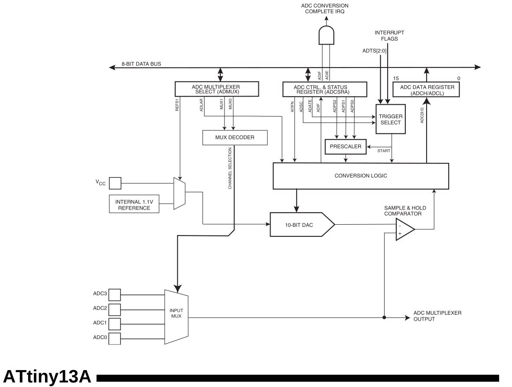

*23:35*  
Не закончил с таймерами, но срочно захотелось прикрутить клавиатуру на делителях напряжения, поэтому решил прочитать про `ADС`. Пока что применительно к `AVR`.
И тема оказалась достаточно интересной.

**Примечание**
Клавиатура на делителях напряжения - способ сэкономить пины, подключив несколько кнопок к ADC
Нажатием каждой кнопки создает на пине разное напряжение.
Замеряем напряжение - реагируем в программе.

**14. Analog to Digital Converter**

"Разрешение" `ADC attiny13a` - 10 бит
"Ошибка" по модулю до 2 `LSB` (least significant bit). 
```
LSB = Vref / 1024
```
 

Показания можно снимать с 4 пинов, выбираемых через мультиплексор. (Правда один из них это `RESET` пин)
Результат 10 битное число - записывается не очень удобно в 2 регистра (`ADCH`, `ADCL`) 8 бит в одном и 2 в другом
Но можно выбрать 8 битный режим, тогда все число поместится в 1 регистр

В качестве `Vref` можно выбрать как `Vcc` так и внутренний источник напряжения 1.1V

Запускать измерение можно как "вручную" так и используя `PCINT`/`EXTI`/`Timer`/`Analog Comparator` в качестве триггера
Либо включить непрерывные преобразования (запускать следующее преобразование сразу после завершения текущего)

Кроме того `ADC` может работать в специальном режиме сна для повышения точности (`Sleep Mode Noise Canceler`). Тогда глушится работа `CPU` и периферии, производится замер, по завершении которого `CPU` запускается.

**Принцип работы**

На входе в `ADC` (после мультиплексора, если на схеме `attiny13a` смотреть) стоит `Sample & Hold Comparator`.
Его задача - взять "пробу" (sample) напряжения со входа (с мультиплексора) и удержать его, чтобы можно было производить замеры.
Внутри стоит небольшой конденсатор (14pF total capacitance including Csh). Как следствие - нужно дать этому конденсатору зарядиться, поэтому LLM предлагает "прогреть" `ADC` выкинув первый замер и взяв только второй. Документация говорит следующее:
```
The ADC is optimized for analog signals with an output impedance of approximately 10 kΩ or
less. If such a source is used, the sampling time will be negligible. If a source with higher imped-
ance is used, the sampling time will depend on how long time the source needs to charge the
S/H capacitor, with can vary widely. The user is recommended to only use low impedant sources
with slowly varying signals, since this minimizes the required charge transfer to the S/H
capacitor.
```

Кроме того на вход в `SHC` (по схеме из документации) приходит напряжение, генерируемое `10-bit DAC`, образованное "делением" референсного напряжения.
Затем, по сути, выполняется бинарный поиск. Компаратор обеспечивает операцию сравнения, а `Conversion Logic` блок генерирует новое напряжение и "ищет" следующий бит.

1. Заряжаем конденсатор
2. Производим серию замеров используя в качестве алгоритма бинарный поиск
3. Забираем результат

**Тактирование**

`ADC` тактируется от частоты `F_CPU` пропущенной через `prescaler`. Значение `prescaler` нужно выбирать таким образом, чтобы время одного (полного) преобразования укладывалось в диапазон `13 - 260 µs`.

Время одного преобразования однозначно зависит от частоты т.к. всегда занимает 13 `ADC` циклов.
`prescaler = F_CPU * dt / 13`
Таким образом для `F_CPU == 9.6Mhz` `prescaler` должен быть от 9.6 до 192.
По факту доступны значения степеней двойки от 2 до 128

Насколько я понимаю это ограничение на время связано именно с требованиями к зарядке S/H конденсатора. 
Конверсия гарантированно занимает 13 `ADC` циклов. 10 циклов уходит на сам замер (10 бит результата), а около 1.5 цикла отводится на выборку и удержание входного напряжения на этом конденсаторе.

P.S. Первая конверсия после запуска ADC занимает 25 циклов (14.5 на S&H)
P.P.S. Документация atmega328p просит соблюдать время конверсии `65 to 260µs`, хотя Csh также = 14pF

```
14.5 Prescaling and Conversion Timing

A normal conversion takes 13 ADC clock cycles. The first conversion after the ADC is switched
on (ADEN in ADCSRA is set) takes 25 ADC clock cycles in order to initialize the analog circuitry
...
The actual sample-and-hold takes place 1.5 ADC clock cycles after the start of a normal conver-
sion and 14.5 ADC clock cycles after the start of an first conversion.
```

#adc #attiny


---

*18:09*  
Клавиатуру захотелось прикрутить, потому что подумалось, что вместе с `ws2812b` лентой это идеальная комбинация для `attiny13a` 🤣 

И клавиатура и лента для индикации занимают по одному пину. И ещё остаётся целых 3 свободных. 😱

Для примера - управление ШИМ с индикацией через ленту.

К слову, если добиться, чтобы все кнопки клавиатуры давали `<0.3*Vcc`, то можно использовать `PCINT0` прерывание с того же пина, чтобы стартовать чтение `ADC`. Правда без задержки в коде, полностью с аппаратным триггером, у меня пока не заработало. 

#attiny #ws2812b #pwm
[Video: videos/video_16@01-02-2026_18-09-23.mp4](videos/video_16@01-02-2026_18-09-23.mp4)