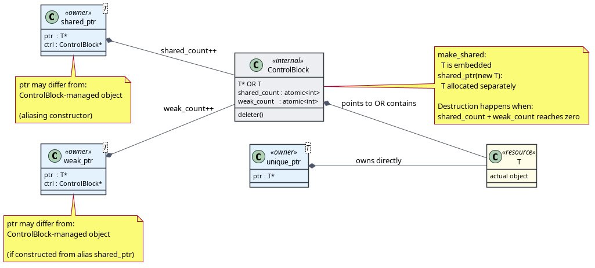

*10:12*  
**std::weak_ptr : Weak Pointer**

[https://en.cppreference.com/w/cpp/memory/weak_ptr.html](https://en.cppreference.com/w/cpp/memory/weak_ptr.html)

Указатель, не владеющий объектом. "Пара" для Shared Pointer.
Объектом он не владеет, но на равных с `shared_ptr` правах владеет блоком с метаданными.

Учебная имплементация, в которой много чего не хватает:
[https://gist.github.com/bakineugene/2ae0ad7d1f2f4d011f87a1582ef410ba#file-weak-h-L5](https://gist.github.com/bakineugene/2ae0ad7d1f2f4d011f87a1582ef410ba#file-weak-h-L5)

**Usage**

`weak_ptr` можно создать только пустым или из `shared_ptr`. "Наполнить" `weak_ptr` также можно присваиванием `shared_ptr`.

`API`, на мой взгляд, очень элегантное. `weak_ptr` не дает доступа к объекту, но если объект еще жив - дает создать `shared_ptr`, тем самым "залочив" объект. Метод так и называется - `lock`.

```
Creates a new std::shared_ptr that shares ownership of the managed object. If there is no managed object, i.e. *this is empty, then the returned shared_ptr also is empty.
```

Если на момент вызова `lock` объект уже уничтожен - вернется пустой `shared_ptr`.
Альтернатива - создать `shared_ptr` через конструктор, передав туда `weak_ptr`, но в случае, если объект уничтожен - прилетит исключение.

**Alias pointer**

Я не нашел в `reference` и LLM меня убеждало в обратном, но исходя из эксперимента `alias shared pointer` при преобразовании в `weak pointer` сохраняет `alias`

```cpp
int main(void) {
    auto base_ptr = std::shared_ptr<int[]>(new int[2]);

    base_ptr[0] = 123;
    base_ptr[1] = 456;

    auto ptr_1 = std::shared_ptr<int>(base_ptr, &base_ptr.get()[1]);

    std::cout << "ptr_1 = " << *ptr_1 << std::endl;

    auto weak = std::weak_ptr(ptr_1);
    auto ptr_2 = weak.lock();
    std::cout << "ptr_2 = " << *ptr_2 << std::endl;
}
```

```
$ ./a.out
ptr_1 = 456
ptr_2 = 456
```

**gotcha**

Интересный момент. Если создать `shared_ptr` через `std::shared_ptr{new Object}` - то произойдет две аллокации. Одна на Object, одна на блок с метаданными. Если же создать через `std::make_shared<Object>()`, то всего одна! И объект, на который указывает `shared_ptr` будет храниться прямо вместе с метаданными.

И тут получается, что если жив хоть один `weak_ptr` при `shared_count == 0` - будет вызван деструктор, но память не будет освобождена. Блок с метаданными нельзя уничтожать пока есть хоть один `weak_ptr`. Если выделить большой кусок памяти через `make_shared` - может быть болезненно.

#cpp #smart_pointers #memory #weak_ptr #shared_ptr
