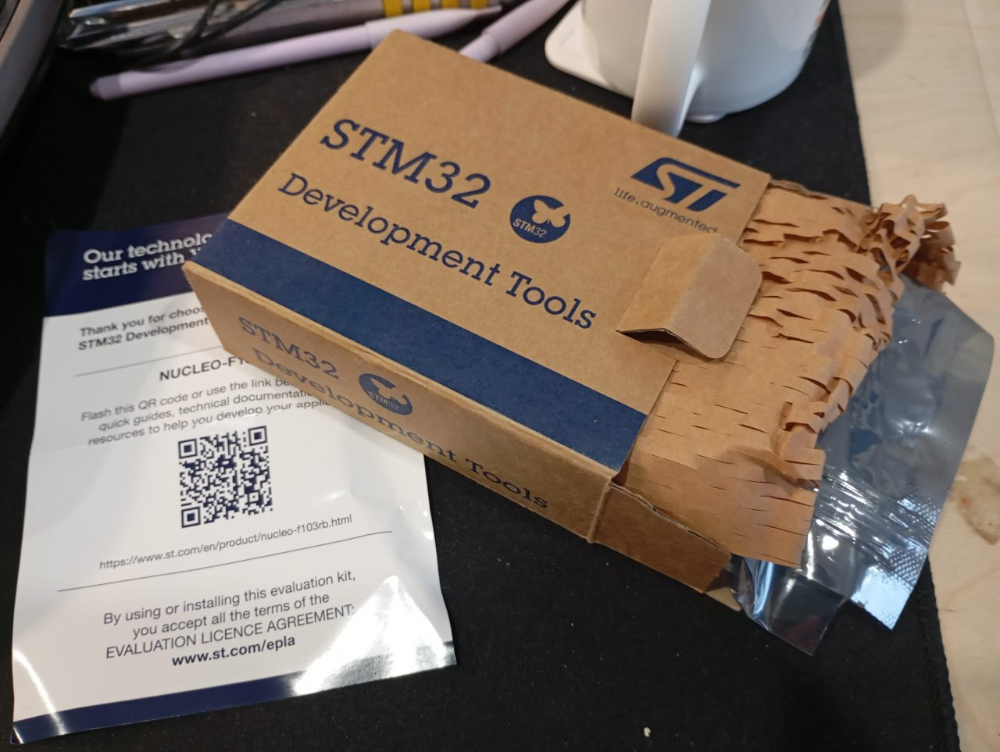
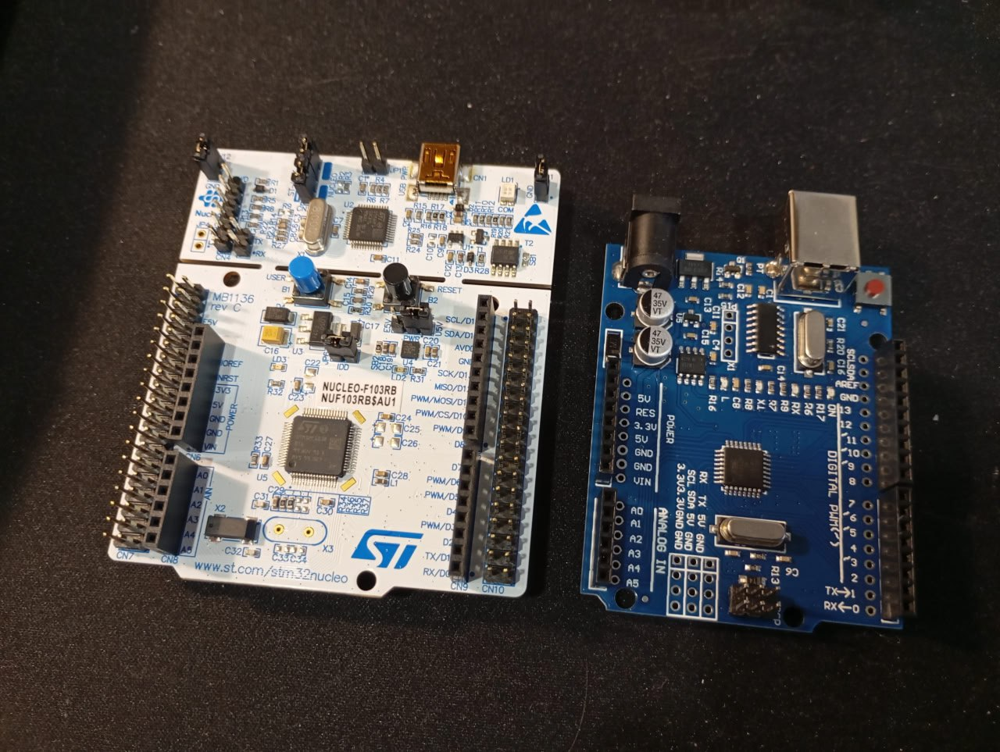
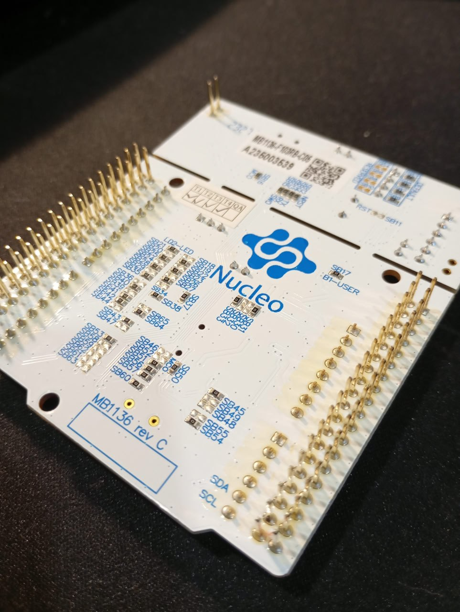
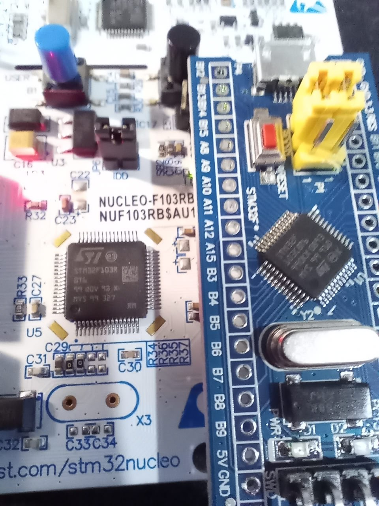
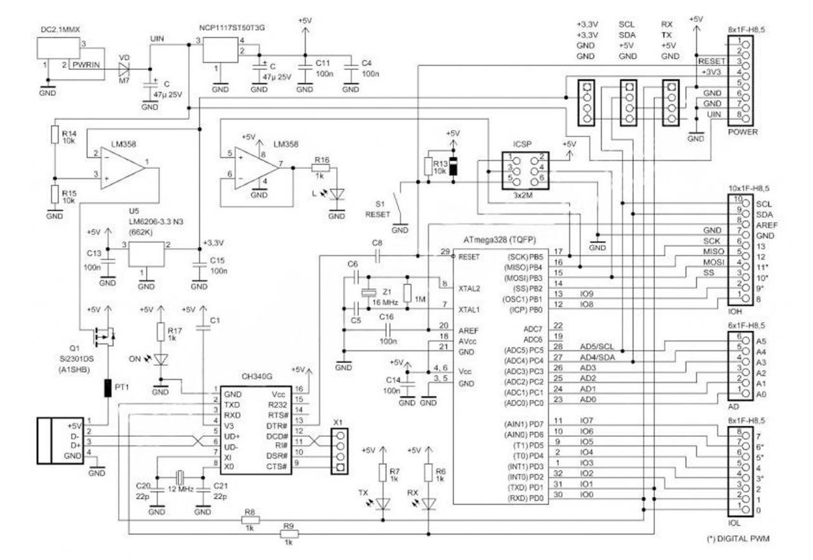
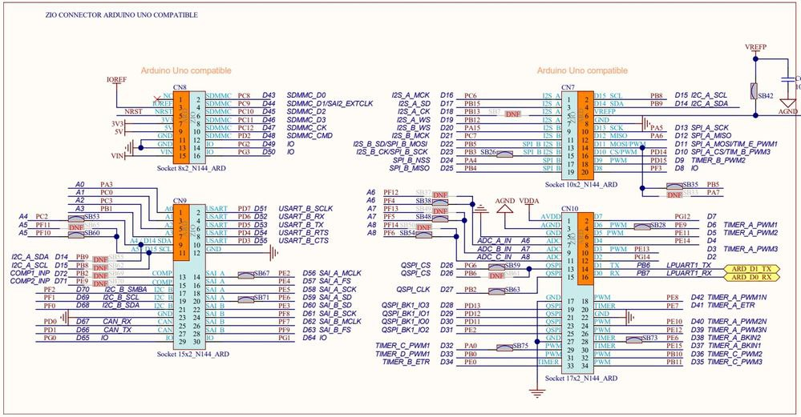

*11:06*  
**Nucleo development board**

Когда записывался на курс по `stm32` в списке оборудования были платы Nucleo и Miluino. Я прикупил обе. 💰 Но сперва они показались мне черсчур прекрасными для моих кривых ручонок и я начал с `blue pill`. А недавно подумал - "а чё это", надо и к прекрасному иногда прикасаться.

Начну с Nucleo.

**Упаковка**

Заказывал с Aliexpress. Приходит в коробке. Внутри хитро нарезанная бумага для объема, бумажка с qr кодом и плата в антистатическом пакете.

**Внешний вид**

Белая. Две секции - одна с МК, которым мы управляем. Другая с ST-LINK программатором.
Между ними прорезь, которая как будто предполагает, что плату можно разломать на две части и пользоваться ими по отдельности. 😨
И, судя по всему, это действительно можно сделать - пины программатора выведены отдельно, им можно пользоваться независимо. Питание и генератор задающей частоты идут также с платы программатора, но предусмотрена возможность переключиться на независимое питание и кварцевый генератор. Правда на моей плате кварца на второй стороне нет.

Не знаю, есть ли такие люди, которые отламывали часть с программатором. 🤔

На плате присутствуют штырьки для всех пинов МК. Причем выведены они как на верхнюю сторону платы, так и на нижнюю.

Также присутствуют "гнезда" arduino style. Причем, как оказалось, это буквально arduino style. Гнезда предполагают совместимость с arduino шилдами.
Гнезда даже промаркированы в ардуино формате - A0-A5 (аналоговые порты) и D0-D15 (цифровые). STM32 специфичной маркировки нет. Штырьки не промаркированы никак. "Очень удобно". Зачем мне знать как называются эти штырьки по понятиям arduino?

Лучше бы на бумажке хотя бы распиновку печатали, а не qr code.

На плату выведена кнопка RESET и кнопка USER, подключенная к C13.
Также на плату выведен красный LED питания и зеленый пользовательский LED, выведенный на ногу PA5.

Некоторые из моих сокурсников пишут в чате, что сожгли SPI, у которого на эту ногу приходит SCK. Видимо при попытке включить одновременно и SPI и мигать светодиодом. Для интереса я стал смотреть в чем отличие Nucleo и Arduino UNO в этом месте и обнаружил, что на UNO светодиод подключен не напрямую к МК, а через операционный усилитель (на всех моих платах - LM358). Не буду делать выводов, как именно влияет ли это на выживаемость МК и работу SPI, так что просто информация для размышления.

И светодиод и кнопку можно отключить с помощью одного из многочисленных solder bridges, предназначенных для настройки работы платы. Они находятся на нижней стороне.

А также есть специальный джампер IDD, для подключения амперметра.

**Характеристики**

В отличие от моих "таблеток", тут STM32F103RBT6 - больше памяти и больше пинов.

```
STM32F103RBT6
Flash: 128 Kb
SRAM: 20 Kb
Package: LQFP-64
GPIO: 51
```

**Разное**

При подключении по USB открывается "флешка", в которой лежит ссылка на сайт [https://os.mbed.com/platforms/ST-Nucleo-F103RB/](https://os.mbed.com/platforms/ST-Nucleo-F103RB/)

Дефолтная прошивка предлагает нажать на кнопку и лицезреть, как меняется частота мигания светодиода.

После замены букв портов и номеров пинов мигалка от `blue pill` завелась без приключений.

Не то, чтобы был особый смысл в покупке этой платы. Возможно, в некоторых случаях, это удобнее чем breadboard + blue pill. Время покажет.

#stm32 #nucleo


---

*11:06*  



---

*11:06*  



---

*11:06*  



---

*11:06*  



---

*11:06*  



---

*11:06*  

[Video: videos/2026-02-07 16-47-45.mp4](videos/2026-02-07 16-47-45.mp4)

---

*11:06*  

[Video: videos/2026-02-07 18-09-11.mp4](videos/2026-02-07 18-09-11.mp4)