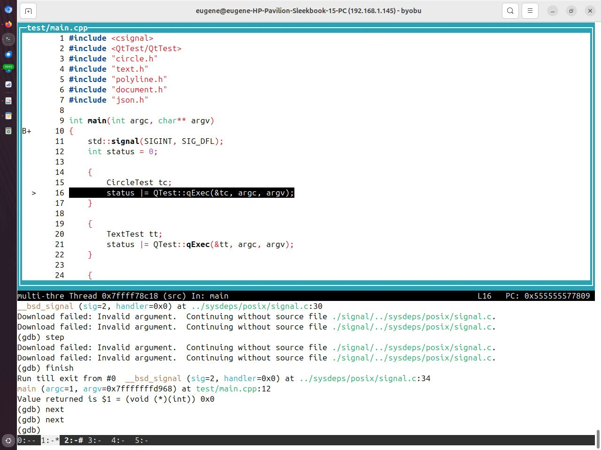

*12:09*  
**GDB cheat sheet**

Будет пополняться по мере необходимости

Для дебага лучше собирать без оптимизаций и с выводом отладочной информации 

`CXXFLAGS := -O0 -g`

```
       -g  Produce  debugging  information in the operating system's native format (stabs, COFF, XCOFF, or DWARF).  GDB
           can work with this debugging information.

           On most systems that use stabs format, -g enables use of extra debugging information that only GDB can  use;
           this extra information makes debugging work better in GDB but probably makes other debuggers crash or refuse
           to  read  the  program.   If  you want to control for certain whether to generate the extra information, use
           -gvms (see below).
```

`gdb --args ./build/main` - запуск в дебаггере
`gdb -p PID` - подключиться к запущенному процессу

`run` - запустить программу
`catch throw` - остановиться после выброшенного исключения
`catch catch` - остановиться после пойманного исключения
`catch signal SIGNAL` - остановиться при пойманном сигнале

`break function_name` - breakpoint по имени функции
`break file.cpp:42` - breakpoint по строке в файле
`break foo if x == 10` - условный breakpoint

`bt` - вывести текущий стек вызовов

`step` - следующая инструкция (step into)
`next` - следующая инструкция (step over)
`finish` - выполнять до выхода из функции (step out)
`continue` - продолжить выполнение

`print var` - вывести значение переменной
`display var` - выводить значение переменной при каждом шаге
`watch var` - breakpoint на изменение переменной

`list` - вывести код

`info args` - аргументы текущей функции
`info locals` - локальные переменные

`tui enable` - псевдографический интерфейс 😱

**print == Evaluate**

🤯

`print` позволяет вычислить любой expression в текущем контексте и выводит результат.

*Оказалось, что не любой, на некоторых падает. На каких - пока не понял.*

```
(gdb) print Print(str_node)
$15 = "\"Hello, \\\"everybody\\\"\""
```

**Повтор команды**

Нажатие `ENTER` приведет к повтору предыдущей команды. 
Т.е. можно ввести `continue`, а потом жамкать `ENTER`

**Сохранение истории команд**

Отредактировать `~/.gdbinit`

```shell
set history save on
set history filename ~/.gdb_history
set history size 1000
```

Работает примерно как в `bash`

Отдельно настройка для того, чтобы включить редактирование команд из истории

```bash
set editing on
```

**Автокомплит**

Неожиданно, для break работает автокомплит, правда очень сильно тормозит

Чтобы ускорить можно перед запуском gdb проиндексировать символы

```shell
gdb-add-index ./build/main
```

**Pretty Print**

```
set print pretty on
```

Форматированный вывод

```cpp
(gdb) print *this
$1 = {
  root_ = {
    value_ = std::variant [index 6] = {"Hello, \"everybody\""}
  }
}
```

**Альтернативные шпаргалки**
[https://hybras.gitlab.io/page/gdb/](https://hybras.gitlab.io/page/gdb/)
[https://habr.com/ru/articles/535960/](https://habr.com/ru/articles/535960/)
[https://darkdust.net/files/GDB%20Cheat%20Sheet.pdf](https://darkdust.net/files/GDB%20Cheat%20Sheet.pdf)
[https://cs.brown.edu/courses/cs033/docs/guides/gdb.pdf](https://cs.brown.edu/courses/cs033/docs/guides/gdb.pdf)

#gdb #cheatsheet
