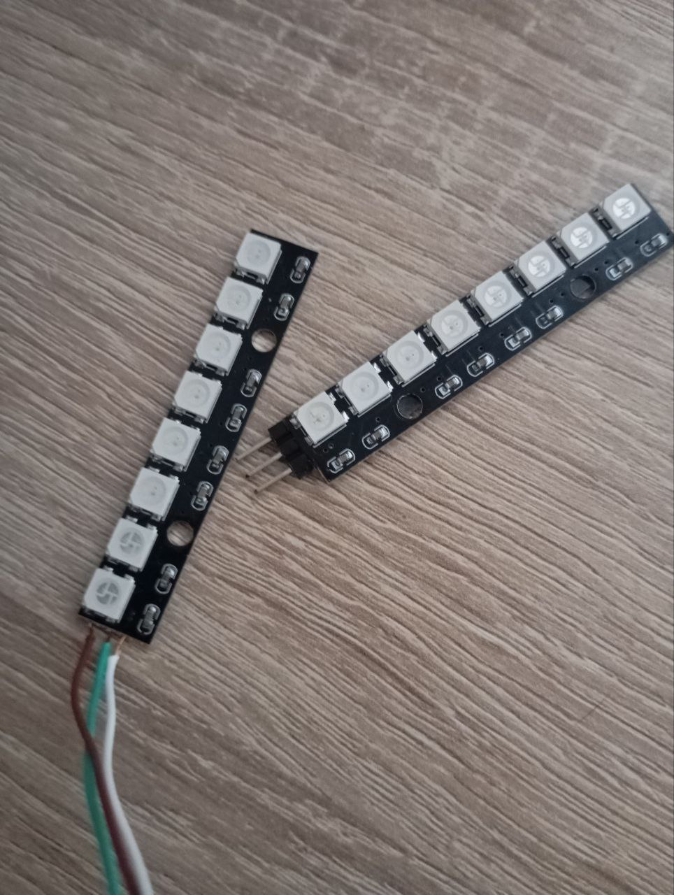

*13:58*  
Уже два дня "дебажу" управление мотором с микроконтроллера.

Собрал, видимо, все грабли. Потому что зачем читать инструкции — надо воткнуть, и мотор делает брррр... 🙄

Плюс, я, наверное, начал понимать, зачем нужны девборды. Сегодня спалил суммарно уже вторую "индикаторную ленту" - она сорвалась с липкой ленты и приземлилась на неудачно подвернувшуюся катушку припоя. Которая что-то там закоротила. 

В первый раз была похожая ситуация.

Если добавить к той же Nucleo/Uno шилд с кнопками и индикаторами — провода от них не будут мешаться под руками.

#мысли_вслух

---

*11:07*  
**Повесть "программист против физики"**

Я подключаю мотор через модуль с двумя параллельно включенными MOSFET D4184.

Первое, с чем я столкнулся — постоянные перезагрузки и зависания МК.  
В целом, я этого даже ожидал — до этого ни разу не ставил никаких фильтров по питанию.

Воткнул электролит помощнее — мотор забрррчал.

---

На этом этапе оно уже как-то работало. Я немного поигрался и даже видосик заснял.

Но при снижении коэффициента заполнения до 50–60% у мотора почти полностью пропадал крутящий момент.  
Любое вмешательство — и он останавливался.

---

Сначала я начал крутить параметры ШИМ.

На маркетплейсе (даташит я тогда ещё не нашёл) было написано, что модуль работает на частотах до 20 kHz.  
Я поднял частоту до ~14 kHz.

Стало хуже.

Теперь мотор останавливался уже на 70% от малейшего прикосновения.

---

Пошёл мучить LLM.

Сначала неправильно прочитал осциллограмму и решил, что MOSFET открывается недостаточно быстро и нужен gate driver.

Потом понял, что проблема в индуктивной нагрузке.  
Об этом, кстати, даже у Гайвера написано — просто я не сопоставил сразу.

---

Поставил flyback diode — мотор ожил.

Но при попытке остановить его рукой — снова перезагрузки и зависания МК.

---

Тогда я запитал МК от отдельного источника — и всё заработало как часы.

- мотор не останавливается даже при 5–10%
- запуск происходит уже с ~15% (раньше нужно было ~80%)

---

Во второй день я пытался победить зависания не используя мозг. 🤪

- обвешал всё конденсаторами
- добавил линейный стабилизатор перед МК
- от отчаяния применил ещё пару советов от GPT:
  - скрутил провода
  - добавил диод на вход питания МК

После этого поведение более-менее стабилизировалось, но выглядело как месиво.

---

Сегодня с утра вспомнил, что вообще-то я тут же год назад про фильтры писал.

Рассчитал RC и LC на ~1kHz. 
- RC в целом работает, но когда опускаю коэффициент заполнения ниже 5% - МК перезагружается.
- LC работает стабильно. 

---

в диапазоне 0–30% ШИМ мотор вёл себя нелинейно —  
при увеличении мощности на некоторых участках обороты падают.
А также минимальные обороты слишком высокие
Оказалось переборщил с конденсаторами на моторе

**В итоге**:

- На входе по питанию МК - LC фильтр (~200 uF, ~120 uH)
- Обратный диод на выходе модуля с мосфетами
- Керамический конденсатор на входе по питанию мотора
[Video: (File exceeds maximum size. Change data exporting settings to download.)]((File exceeds maximum size. Change data exporting settings to download.))