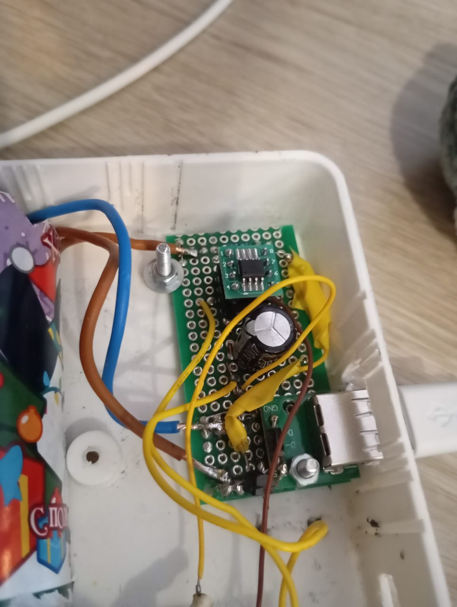

Видео:  
[https://disk.yandex.ru/i/tofG1TMmA7SXGA](https://disk.yandex.ru/i/tofG1TMmA7SXGA)  
[https://disk.yandex.ru/i/plRP7e0QzWXUtw](https://disk.yandex.ru/i/plRP7e0QzWXUtw)  

Купил я тут поилку для котофея. И всё бы хорошо, но кот пить из неё отказывается.

Засидевшись допоздна, я понял почему — поилка гудит. В тишине это особенно раздражает. В одной комнате находиться невозможно.

Если её выключить, то кот с удовольствием пьёт воду, которая накопилась в верхней ёмкости.

И тут мне подумалось, что это прекрасная возможность забабахать что-то полезное на МК (хотя, возможно, можно было обойтись чем-то ещё более простым — например, NE555).

Задумка простая — раз в N минут включать поилку и обновлять воду в верхнем резервуаре.

Чтобы получить немного опыта работы с биполярными транзисторами, решил в этот раз использовать их. Насос потребляет не более 0.25 A при старте, а после — около 0.125 A.

Взял PNP S8550 (до 600 мА), собрал схему с общим коллектором и использовал транзистор в ключевом режиме для включения насоса. А насос то включается, то не включается. На насосе напряжение ~4.2 В вместо 5 В.

Потратил достаточно много времени, пока не догадался замерить падение напряжения на проводах. Оказалось, что мои покупные проводки — с крокодилами и «дюпоны» — «съедают» почти 0.5 В, и насос уже отказывается стартовать.

Скорее всего и в прошлый раз (с другим мотором) они добавляли проблем.

Нашёл самые толстые соединительные провода из тех, что у меня были для бредборда, и оставил схему на ночь. Утром пришёл, посидел 10 минут рядом — не работает. Добавил «heartbeat»-светодиод, чтобы понимать, что МК не «завис». Оставлю ещё поработать.

Но, видимо, в случае со всякими моторами и насосами «силовую» часть стоит разводить хотя бы на макетной плате.

---

Штош. Это была моя первая попытка собрать что-то законченное.

Ретроспектива мини-проекта:

Начертил элемент на схеме, но забыл оставить для него место на плате, и пришлось вкорячивать - ✅
Поставил транзистор задом наперед - ✅
Забыл предусмотреть, как плата будет крепиться к корпусу - ✅
Подвел провода не к тем пинам МК, потому что перед этим перевернул плату, и минут 20 не мог понять, почему не работает - ✅

Очень хочу перейти к тому, чтобы проектировать и заказывать платы, но что-то мне подсказывает, что там я буду совершать те же ошибки, но стоить это мне будет дороже.

Из доработок:

* Добавил кнопку принудительного включения насоса
* Увеличил время задержки до 30 минут

В целом этим небольшим опытом я доволен. Чувство, когда оно начинает работать, - великолепно.

Как и чувство, когда оно не работает нифига, хотя вот на предыдущем шаге работало же.

