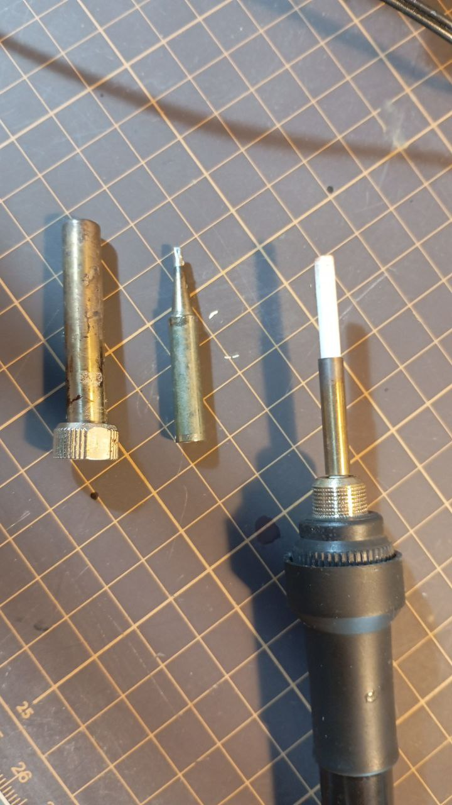

*13:22*  
TIL

У моего паяльника диаметр нагревателя 3.9мм
Внутренний диаметр жала ~4мм
Внешний диаметр жала 6.5мм

И я был почему-то уверен, что все, что продается под маркировкой 900М-Т - это оно и есть.

Но там продают и внутренний диаметр 4.5мм и 3.86мм и, возможно, что-то ещё.

И хорошо ещё, если укажут в описании.

Те у кого профессиональные станции, видимо, просто покупают жала от производителя за много денег. Остальные страдают. 

🙄
