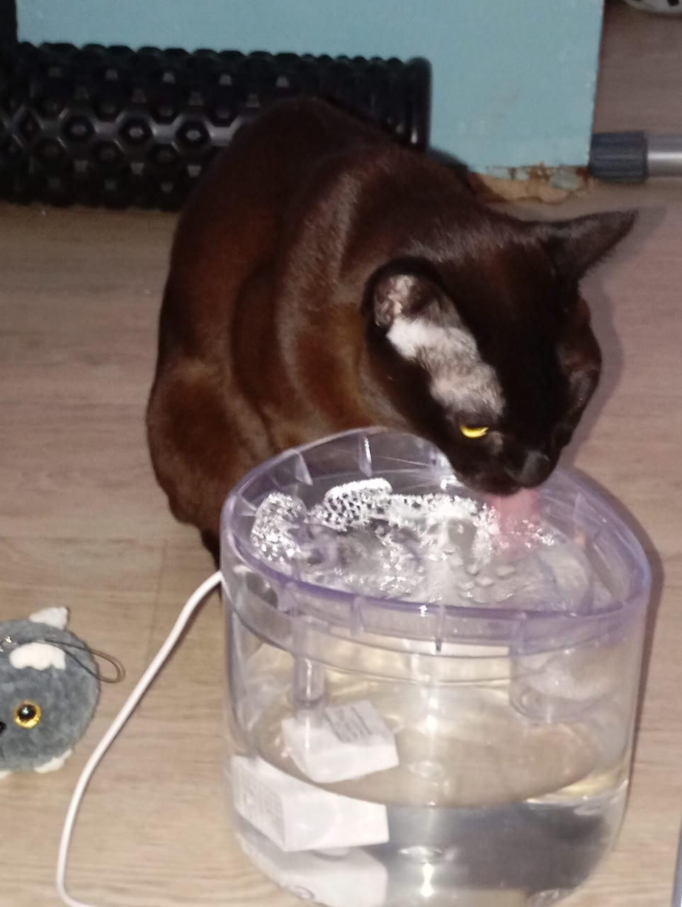
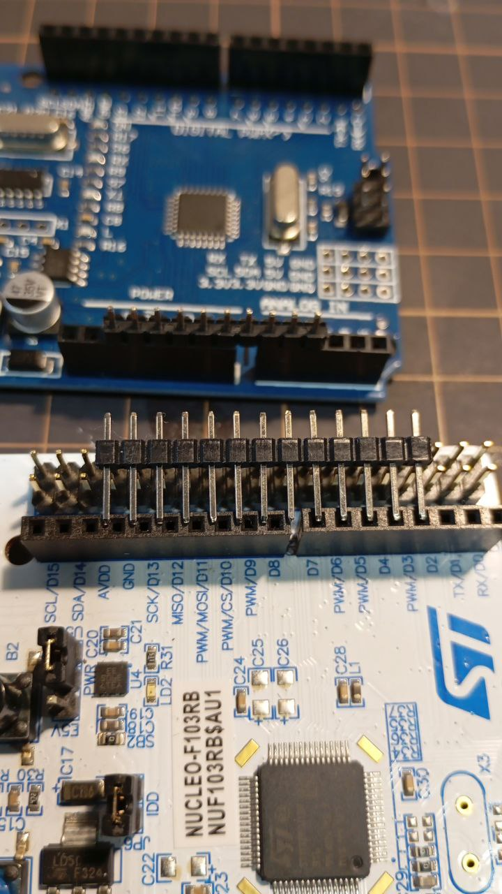

*16:39*  
Штош. Это была моя первая попытка собрать что-то законченное.

Ретроспектива мини-проекта:

Начертил элемент на схеме, но забыл оставить для него место на плате, и пришлось вкорячивать - ✅
Поставил транзистор задом наперед - ✅
Забыл предусмотреть, как плата будет крепиться к корпусу - ✅
Подвел провода не к тем пинам МК, потому что перед этим перевернул плату, и минут 20 не мог понять, почему не работает - ✅

Очень хочу перейти к тому, чтобы проектировать и заказывать платы, но что-то мне подсказывает, что там я буду совершать те же ошибки, но стоить это мне будет дороже.

Из доработок:

* Добавил кнопку принудительного включения насоса
* Увеличил время задержки до 30 минут

В целом этим небольшим опытом я доволен. Чувство, когда оно начинает работать, - великолепно.

Как и чувство, когда оно не работает нифига, хотя вот на предыдущем шаге работало же.

Видео: [https://disk.yandex.ru/i/tofG1TMmA7SXGA](https://disk.yandex.ru/i/tofG1TMmA7SXGA)

---

*16:39*  

---

*19:36*  
Рандомный факт:

Расстояние между гребенками на `digital` стороне Arduino несовместимо с `DIP` форматом.

И, судя по ответу на Stack Overflow ([https://electronics.stackexchange.com/questions/940/arduino-pin-spacing](https://electronics.stackexchange.com/questions/940/arduino-pin-spacing)) - это ошибка, которую впоследствии решили не исправлять для обратной совместимости.

Но теперь это приводит к тому, что нельзя просто накинуть перфборд на Arduino.
