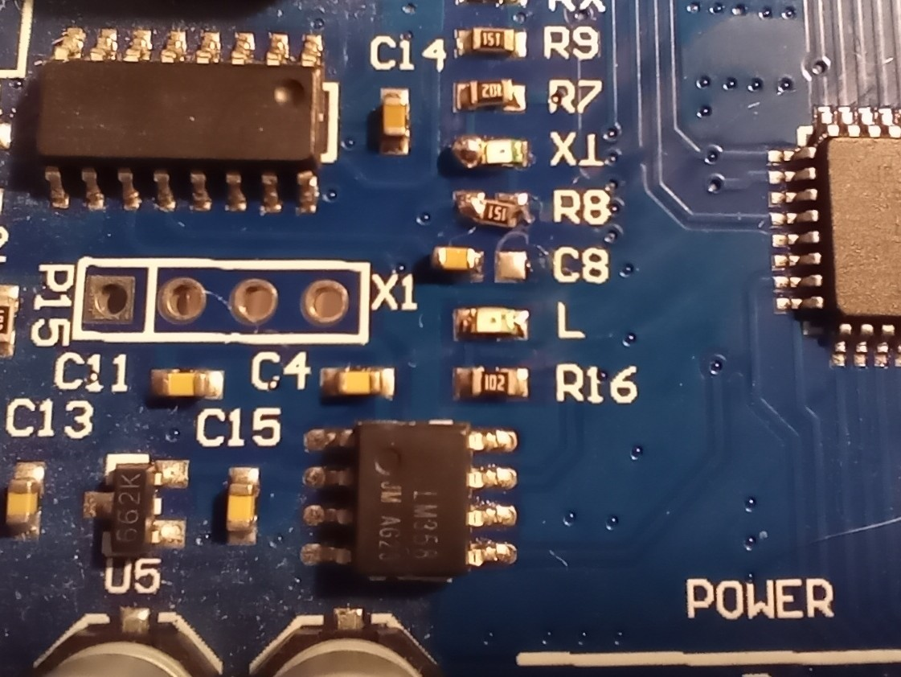
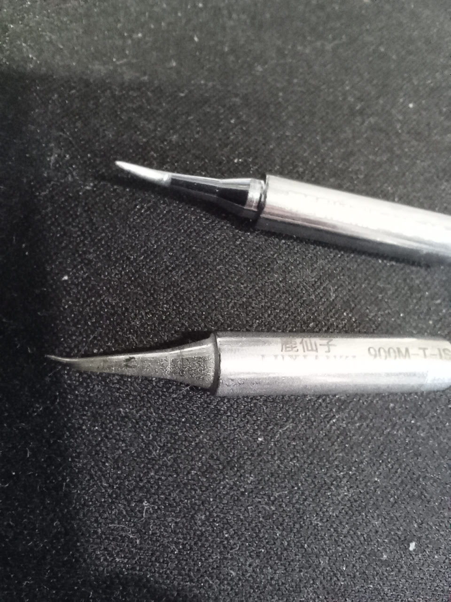
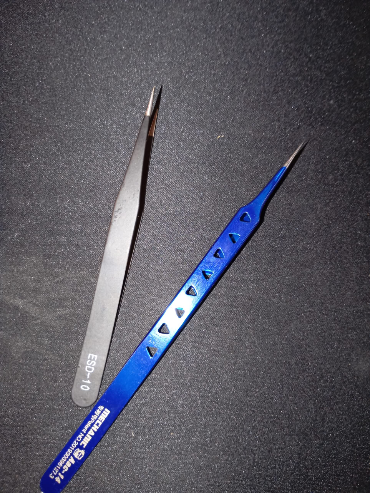

На работе произошла незапланированная смена проекта и команды в начале месяца.
Пока погружаюсь в новый проект — времени ни на что не хватает, все курсы пошли по бороде.

Язык — Java + Scala, но под боком есть команда с кодом на "плюсах", надеюсь, выдастся случай написать пару строк.
В общем, только на этой неделе более-менее начало появляться свободное время. Поэтому понемногу начинаю возвращаться к занятиям.

Я в новый год обрадовался возможности накодить что-то полезное на ATtiny13A и завис на нём. Чего, конечно, очень сильно не хватало, — так это возможности выводить какую-либо информацию для дебага. Так что переезжаю в AVR-части своих экспериментов на ATmega328P.

На «унах» есть преобразователь USB–UART, но с ним есть одна проблема, которая меня раздражает: авторесет при подключении.

Авторесет нужен для работы бутлоадера, но я пользуюсь внешним программатором, поэтому эта фича, по сути, бесполезна.

В принципе, можно просто перерезать дорожку, но я недавно заказал-таки подходящие тоненькие жала для паяльника и пару пинцетов и решил попрактиковаться в работе с SMD-компонентами.

План был — аккуратно перенести конденсатор, соединяющий USB–UART-чип с пином RESET.

  

  

Вооружившись феном, я успешно это проделал, но после — сшиб стоящий рядом резистор. 🙄

Попытавшись поставить на место резистор, — сшиб следующий по очереди светодиод. 🫠 

На этом принцип домино, к счастью, работать перестал.

В общем, криво-косо, что-то да напаял до рабочего состояния. 😂 
В результате понял, что надо тренироваться, и заказал наборы для пайки SMD. 💰